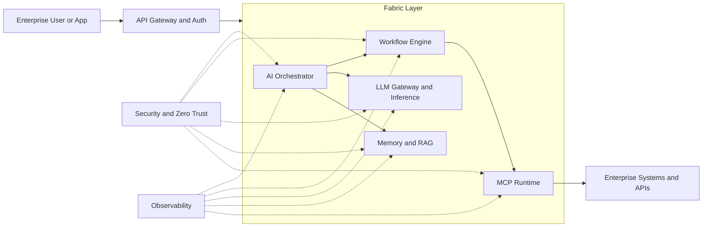

# aiops-fabric

Business Brand: LatticeCore® Platform

## Overview

This repository is the architecture and platform-organization workspace for LatticeCore® Platform. It keeps enterprise AI design, governance guidance, and platform domain scaffolding in one place so design and implementation remain aligned as the platform evolves.

## High-Level Concept

Detailed design hierarchy is documented in [docs/design/high-level/design_01.md](docs/design/high-level/design_01.md).

## Top-Level Directories

| Directory | Purpose |
|---|---|
| [docs](docs) | Architecture, design, and governance documentation (including high-level system design and prompt guardrails). |
| [fabric](fabric) | Core platform domains and implementation scaffolding for deployable AI platform components. |

