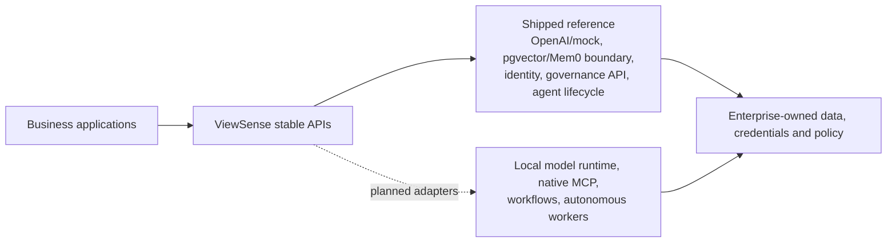

# ViewSense: Enterprise AI Without Losing Control

ViewSense is the control backbone for an organisation's AI. It lets teams use private models, cloud AI, company knowledge, automated agents, and business tools through one governed platform without making the organisation permanently dependent on one vendor.

It can run in an enterprise data centre, a private cloud, a public cloud, or across several locations. The organisation decides where data may travel, which AI providers may be used, what an agent is allowed to do, and when a person must approve an action.

The business model is the target operating model. The repository's exact executable scope is kept
separately in the [implementation conformance map](docs/design/high-level/00-implementation-conformance.md).

## The business problem

Enterprises increasingly have separate AI assistants, model providers, vector databases, automation products, and tool integrations. Each product brings its own identity, security, audit, data-retention, and operational model. This creates duplicated cost, inconsistent controls, vendor lock-in, and uncertainty about what happened when AI makes a decision or takes an action.

ViewSense provides a stable layer above those products. Applications connect to ViewSense rather than directly to a model, memory database, or automation engine. Products can then be replaced through policy and configuration instead of rewriting every application.

## Business benefits

### Preserve choice

Start with a local model and PostgreSQL, use an approved cloud model for selected workloads, or replace either later. ViewSense keeps the application-facing contract stable.

### Keep sensitive data under control

Requests carry verified identity, tenant, business purpose, classification, residency, and approval context. Policy determines which providers and locations are eligible before cost or speed is considered.

### Make AI actions explainable

ViewSense records why a provider was selected, what approved knowledge was retrieved, which tools an agent requested, which policies applied, and who approved consequential actions. This creates an enterprise AI flight recorder without logging sensitive content by default.

### Reduce vendor lock-in

Models, memory products, workflow engines, and MCP tools are certified providers behind ViewSense APIs. Moving between them becomes a controlled provider change rather than a large application migration.

### Govern agents safely

AI may propose a plan, but deterministic policy controls execution. Budgets, time limits, tool permissions, human approvals, cancellation, and evidence records prevent an agent from silently expanding its own authority.

### Support regulated and disconnected environments

ViewSense is designed for Kubernetes, private installation, isolated business or regulatory cells, and future air-gapped operation. Each cell can keep data local while sharing approved policy and provider metadata.

### Improve operational visibility and cost control

Structured telemetry attributes model, memory, workflow, and tool usage to the correct tenant and provider. Enterprises can build service levels, showback, budgets, alerts, and stop-loss controls without embedding one observability vendor into every service.

## Target operating model in plain language

1. A person or application sends an AI request to ViewSense.
2. ViewSense verifies who is asking, for which organisation, and for what purpose.
3. Policy identifies providers allowed for that data, location, risk, and capability.
4. Approved company memory is retrieved without giving the model direct database access.
5. The selected AI model produces a response or proposes an action.
6. Tool actions pass through a governed gateway and may require human approval.
7. ViewSense records safe evidence explaining the execution, without recording confidential payloads by default.

## Product concepts and current maturity

- **Trust Envelope — implemented reference:** signed tenant, subject, purpose, and classification
  context follows internal requests.
- **Provider Passport and Evaluation Admission — implemented API, partial enforcement:** governance
  records capabilities/evaluations/admission, but runtime gateways do not yet reconcile routes from it.
- **Agent Flight Recorder — partial:** durable lifecycle, approvals, versions, budgets, and safe events
  ship; autonomous plans, tools, and replay-safe side-effect evidence are planned.
- **Governed Memory Fabric — partial:** tenant/owner-bound memory and chunk metadata ship; complete
  source lineage, export/deletion, evaluation, and retention controls are planned.
- **Sovereign AI Cells — planned:** the repository currently deploys one development namespace.

## What ViewSense does not try to be

ViewSense is not another foundation model, vector database, low-code workflow editor, or SIEM. It integrates and governs those products. This focus is what lets an enterprise keep control while technology and suppliers change.

## Current maturity

The repository contains an executable reference covering secure APIs, model routing, a
credential-isolated OpenAI adapter, PostgreSQL/pgvector memory, a Mem0 adapter, MCP governance,
ingestion, durable bounded agent runs, Kubernetes deployment, structured logs, and end-to-end
tests. The Trust Envelope and governance foundation provide signed tenant delegation, provider
passports, evaluation admission, optional OPA decisions, and append-only evidence metadata.

The shipped MCP slice is a registry plus a ViewSense-owned tool-provider API, not native MCP
Streamable HTTP. The agent runtime persists lifecycle/approval state but does not yet run an
autonomous model/tool loop. Governance admission is recorded but is not yet wired into live route
reconciliation.

External OIDC/Keycloak configuration is available at the edge, and Helm profiles record SPIRE,
OpenTelemetry, and workflow integration intent. Production-grade identity operations, SPIRE/mesh
rollout, autonomous agent workers, workflow adapters, real model certification, full telemetry,
high availability, disaster recovery, confidential computing, and multi-cluster sovereign cells
remain staged capabilities. The catalog labels validated, configuration-ready, and planned products
explicitly.

## Intended users

- Executives seeking AI adoption without uncontrolled lock-in or data movement.
- Security and risk teams requiring enforceable policy and audit evidence.
- Platform teams operating local and cloud AI consistently.
- Application teams wanting stable APIs rather than provider-specific integrations.
- Data owners requiring lineage, retention, residency, and deletion controls.

For the current embedded/integratable product list, see the [product catalog](fabric/PRODUCTS.md).
For installation, daily startup, OpenAI configuration, testing, and shutdown, see the
[quick start](QUICKSTART.md).
For architecture, installation, and engineering details, see the [technical guide](TECHNICAL_README.md).
For copy-paste validation, see the [test guide](tests/README.md).
