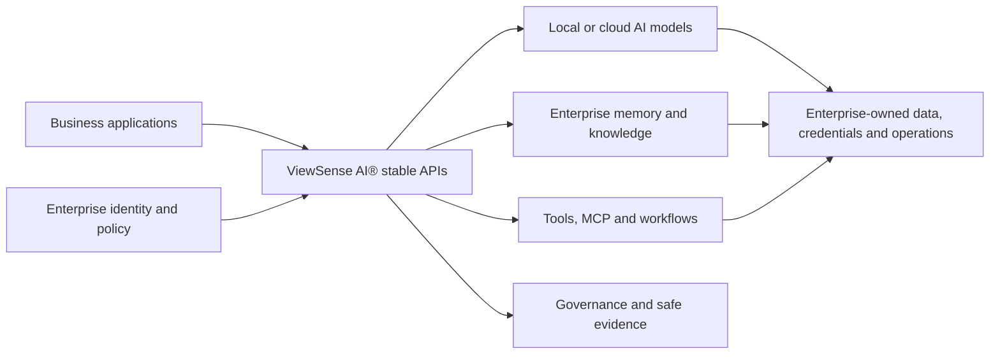

# ViewSense AI®: Enterprise AI Without Losing Control

ViewSense AI® is the control backbone for an organisation's AI. It lets teams use private models, cloud AI, company knowledge, automated agents, and business tools through one governed platform without making the organisation permanently dependent on one vendor.

It can run in an enterprise data centre, a private cloud, a public cloud, or across several locations. The organisation decides where data may travel, which AI providers may be used, what an agent is allowed to do, and when a person must approve an action.

> **Portable · Governed · Replaceable · Enterprise-controlled**

The repository's exact executable scope is maintained separately in the
[implementation conformance map](docs/design/high-level/00-implementation-conformance.md).

## Explore ViewSense AI®

1. **Deploy the portable platform**

    Install the Kubernetes development environment, start the services, and configure an optional
    OpenAI provider. [Open the quick start →](QUICKSTART.md)

2. **Validate real API flows**

    Run copy-and-paste memory, identity, governance, agent, security, and grounded-LLM tests.
    [Open the validation guide →](tests/README.md)

3. **Understand the architecture**

    See component boundaries, trust flows, APIs, state ownership, and replaceability rules.
    [Explore the architecture →](docs/design/high-level/README.md)

4. **Choose products and integrations**

    Compare bundled, adapter, managed-dependency, and external product options.
    [Review the product matrix →](fabric/PRODUCTS.md)

5. **Build governed agentic workflows**

    Design bounded agents, ingestion pipelines, approvals, tools, and workflow-engine integration.
    [Explore the agentic design →](docs/design/high-level/70-agentic/01-agent-runtime-ingestion-workflows.md)

6. **Operate with enterprise controls**

    Apply zero trust, SSO, structured telemetry, evidence, day-two operations, and recovery controls.
    [Review enterprise controls →](docs/design/high-level/60-enterprise/01-enterprise-integration-controls.md)

## The business problem

Enterprises increasingly have separate AI assistants, model providers, vector databases, automation products, and tool integrations. Each product brings its own identity, security, audit, data-retention, and operational model. This creates duplicated cost, inconsistent controls, vendor lock-in, and uncertainty about what happened when AI makes a decision or takes an action.

ViewSense AI® provides a stable layer above those products. Applications connect to ViewSense AI® rather than directly to a model, memory database, or automation engine. Products can then be replaced through policy and configuration instead of rewriting every application.

## Business benefits

| Benefit | Business value |
|---|---|
| Preserve choice | Use approved local or cloud AI products behind stable APIs and replace them without rewriting every application. |
| Keep sensitive data under control | Carry verified identity, tenant, purpose, classification, residency, and approval context through governed requests. |
| Make AI actions explainable | Retain safe evidence about provider decisions, approved knowledge, policy, tools, and human approvals without logging confidential payloads by default. |
| Reduce vendor lock-in | Treat models, memory products, workflow engines, and tools as replaceable providers rather than permanent application dependencies. |
| Govern agents safely | Apply budgets, tool permissions, cancellation, deterministic policy, and human approval to consequential actions. |
| Support private and regulated environments | Package the backbone for Kubernetes deployment in enterprise-controlled data centres, clouds, or isolated environments. |
| Improve visibility and cost control | Attribute usage to the relevant tenant and provider so enterprises can build service levels, budgets, alerts, showback, and stop-loss controls. |

## Native ViewSense AI® foundation

The green tick identifies capabilities owned by the ViewSense AI® backbone rather than delegated to a
specific model, database, identity, workflow, or observability vendor.

| Native capability | Included ViewSense AI® responsibility |
|---|---|
| ✅ Stable API layer | Keeps business applications independent from provider-specific SDKs and interfaces. |
| ✅ Zero-trust service boundaries | Requires encrypted internal communication, explicit audiences, scoped authorization, and tenant-bound context. |
| ✅ Trust Envelope | Carries signed tenant, subject, purpose, classification, and request context between components. |
| ✅ Provider gateways | Isolates model, memory, and tool-provider protocols and credentials behind replaceable boundaries. |
| ✅ Governed memory contract | Provides tenant- and owner-bound create/search APIs without exposing provider databases to callers. |
| ✅ Provider governance and evidence | Provides provider passports, evaluation admission, and payload-minimized evidence APIs. |
| ✅ Bounded agent lifecycle | Provides durable runs, budgets, approvals, cancellation, versions, checkpoints, and safe events. |
| ✅ Vendor-neutral operational output | Provides structured JSON logs and request correlation suitable for enterprise collection. |
| ✅ Kubernetes packaging | Provides portable manifests, Helm configuration, isolated service accounts, and deny-by-default network policy. |

## Target operating model in plain language

1. A person or application sends an AI request to ViewSense AI®.
2. ViewSense AI® verifies who is asking, for which organisation, and for what purpose.
3. Policy identifies providers allowed for that data, location, risk, and capability.
4. Approved company memory is retrieved without giving the model direct database access.
5. The selected AI model produces a response or proposes an action.
6. Tool actions pass through a governed gateway and may require human approval.
7. ViewSense AI® records safe evidence explaining the execution, without recording confidential payloads by default.

## What ViewSense AI® does not try to be

ViewSense AI® is not another foundation model, vector database, low-code workflow editor, or SIEM. It integrates and governs those products. This focus is what lets an enterprise keep control while technology and suppliers change.

## Intended users

- Executives seeking AI adoption without uncontrolled lock-in or data movement.
- Security and risk teams requiring enforceable policy and audit evidence.
- Platform teams operating local and cloud AI consistently.
- Application teams wanting stable APIs rather than provider-specific integrations.
- Data owners requiring lineage, retention, residency, and deletion controls.

For the current embedded/integratable product list, see the [product catalog](fabric/PRODUCTS.md).
For the navigable web documentation, see the
[ViewSense AI® documentation portal](https://diaryfolio.github.io/aiops-fabric/).
For installation, daily startup, OpenAI configuration, testing, and shutdown, see the
[quick start](QUICKSTART.md).
For architecture, installation, and engineering details, see the [technical guide](TECHNICAL_README.md).
For copy-paste validation, see the [test guide](tests/README.md).
