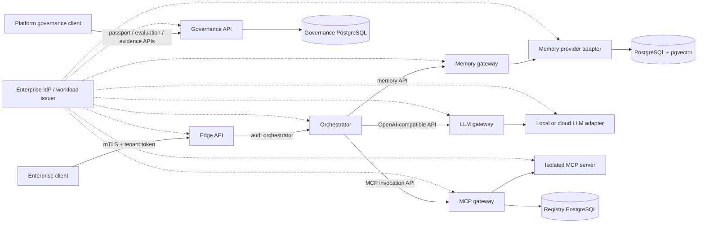

# ViewSense Technical Guide

ViewSense is a portable, enterprise-controlled AI backbone. It gives applications one governed API while allowing LLM runtimes, memory products, vector stores, workflow engines, and MCP servers to run locally or in approved clouds and to be replaced independently.

For the business overview, return to the main [README.md](README.md).

This repository contains the architecture and an executable Kubernetes reference slice. The reference proves the main boundaries without requiring a GPU or external AI account:

- edge API and request orchestrator;
- OpenAI-compatible LLM gateway with a deterministic mock provider;
- vendor-neutral memory gateway with a PostgreSQL/pgvector provider;
- MCP registry and invocation gateway with a test provider;
- short-lived, audience-bound workload tokens plus mutual TLS on every API hop;
- deny-by-default Kubernetes network policies and separate data stores;
- cryptographically bound Trust Envelope delegation plus provider passport, evaluation-admission, and safe evidence APIs.

The mock LLM and deterministic embedding are test adapters, not production AI models. Replace them with vLLM, OpenAI, Azure OpenAI, Mem0, or another contract-conforming provider without changing callers.

## Architecture



Every arrow is a versioned API contract. No service reads another service's database. Provider-specific behavior remains behind adapters.

## Run locally with Kubernetes

Prerequisites: Docker, `kubectl`, `k3d`, and a current Kubernetes context that points to the intended development cluster.

```bash
make unit
make lint
make k8s-deploy
make k8s-test
```

The deployment script builds `viewsense-core:dev`, imports it into k3d, creates short-lived development credentials, and applies resources only to `viewsense-dev`. Generated keys and credentials live under `.viewsense/` and are ignored by Git.

Docker Compose is retained as a quick developer harness:

```bash
make compose-up
make compose-test
```

## Important production boundary

The in-repository identity issuer, static development CA, mock LLM, mock MCP server, and deterministic embeddings exist to make contracts testable. Production installations must integrate enterprise OIDC, automated workload identity/certificate issuance (for example SPIFFE/SPIRE or a service mesh), an external secrets manager, a real embedding service, and production-grade model/MCP providers.

Start with [the architecture index](docs/design/high-level/design_01.md) and [the deployment design](docs/design/high-level/20-deployment/01-deployment-topology-sizing.md).

Copy-paste validation commands, including memory and governance APIs plus negative authorization checks, are in [tests/README.md](tests/README.md).

All contributors and coding agents must follow the design-sync rules in [CLAUDE.md](CLAUDE.md).
