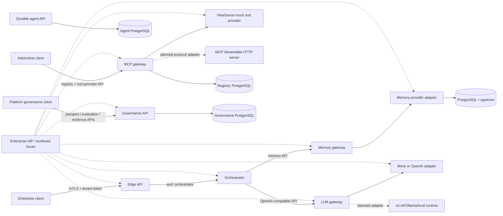

# ViewSense Technical Guide

ViewSense is a portable, enterprise-controlled AI backbone. It gives applications one governed API while allowing LLM runtimes, memory products, vector stores, workflow engines, and MCP servers to run locally or in approved clouds and to be replaced independently.

For the business overview, return to the main [README.md](README.md).

This repository contains the architecture and an executable Kubernetes reference slice. The reference proves the main boundaries without requiring a GPU or external AI account:

- edge API and request orchestrator;
- OpenAI-compatible LLM gateway with a deterministic mock and a credential-isolated OpenAI adapter;
- vendor-neutral memory gateway with a PostgreSQL/pgvector provider;
- a zero-trust Mem0 OSS/Platform adapter behind that same memory contract;
- MCP registry and invocation gateway with a test provider;
- a persistent bounded agent runtime with idempotent creation, checkpoints, approval, cancellation,
  optimistic concurrency, budgets, and ordered event history;
- short-lived, audience-bound workload tokens plus mutual TLS on every internal API hop;
- optional external OIDC/Keycloak verification at the edge and OPA provider-admission decisions;
- deny-by-default Kubernetes network policies and separate data stores;
- cryptographically bound Trust Envelope delegation plus provider passport, evaluation-admission, and safe evidence APIs.

The mock LLM and deterministic embedding are test adapters, not production AI models. The OpenAI
adapter provides a real optional cloud path without exposing its key outside the provider pod.
The contract permits future vLLM, Ollama, Azure OpenAI, and other adapters without changing callers;
only the mock and OpenAI LLM paths ship today. Mem0 has an executable adapter boundary.

## Architecture



Solid arrows are implemented. Dashed arrows are planned. No service reads another service's
database. Provider-specific behavior remains behind adapters.

The integration model has four modes: `bundled` for a portable ViewSense reference component,
`adapter` for a ViewSense API boundary in front of a selected product, `managed-dependency` for a
cluster/platform service operated separately, and `external` for an enterprise or cloud endpoint.
The machine-readable list and exact readiness are in [fabric/PRODUCTS.md](fabric/PRODUCTS.md).

## Run locally with Kubernetes

Prerequisites: Docker, `kubectl`, `k3d`, and a current Kubernetes context that points to the intended development cluster.

Use the [ViewSense quick start](QUICKSTART.md) for first installation, normal daily startup,
cluster recovery, secure OpenAI configuration, port-forwards, testing, and shutdown.

```bash
make unit
make lint
make profile-check
make k8s-deploy
make k8s-test
```

The deployment script builds `viewsense-core:dev`, imports it into k3d, creates short-lived development credentials, and applies resources only to `viewsense-dev`. Generated keys and credentials live under `.viewsense/` and are ignored by Git.

`make k8s-deploy` is an installation/update action, not an everyday cluster-start command. On an
installed suite, `make openai-enable` changes only provider configuration; use
`make openai-enable-fresh` when a full rebuild is also required.

Docker Compose is retained as a quick developer harness:

```bash
make compose-up
make compose-test
```

## Important production boundary

The in-repository identity issuer, static development CA, mock LLM, mock MCP server, deterministic
embeddings, and single-replica databases exist to make contracts testable. Production installations
must operate enterprise OIDC, automated workload identity/certificate issuance (for example
SPIFFE/SPIRE or a service mesh), an external secrets manager, a real embedding service, and
production-grade model/MCP providers. Selecting a Helm profile does not install cluster-scoped
Keycloak, SPIRE, n8n, or OpenTelemetry operators; it configures the ViewSense side of those
boundaries. OPA is the exception and can be deployed as the governance pod's local sidecar.

Start with [the architecture index](docs/design/high-level/design_01.md) and [the deployment design](docs/design/high-level/20-deployment/01-deployment-topology-sizing.md).
Use the [implementation conformance map](docs/design/high-level/00-implementation-conformance.md)
for the exact routes, runtime edges, state owners, and maturity of each integration.

Copy-paste validation commands, including memory and governance APIs plus negative authorization checks, are in [tests/README.md](tests/README.md).
That guide also contains the hidden-key OpenAI setup and a real curl prompt proving that retrieved
ViewSense memory grounds the model response.

All contributors and coding agents must follow the design-sync rules in [CLAUDE.md](CLAUDE.md).
