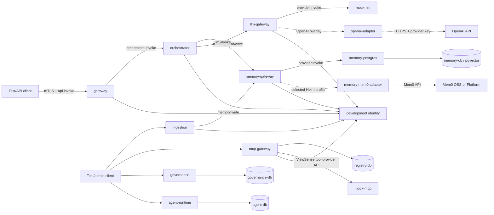
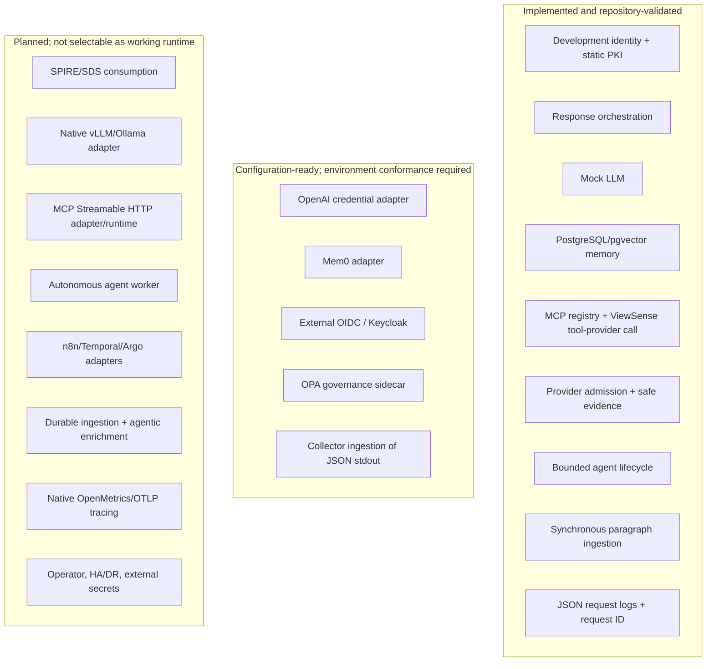
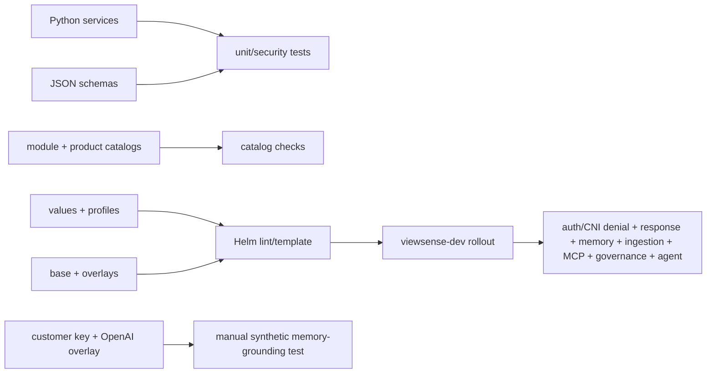

# ViewSense Implementation Conformance

This is the truth map between architecture intent and the repository as shipped. The labels are:

- **implemented:** code, packaging, and an automated repository test exist;
- **configuration-ready:** the ViewSense boundary exists, but an enterprise product or credential is required;
- **planned:** design or selection intent exists, but no executable adapter is shipped.

## Executable reference topology

Solid arrows are calls made by the current code. No arrow means no runtime dependency, even when a
future design allows one.

All solid internal ViewSense service-to-service calls above use TLS with a client certificate plus
a short-lived audience/scoped token. Calls from provider adapters to external vendor APIs instead
use the vendor's HTTPS authentication contract. The development CA proves encrypted, authenticated
transport; it does not provide SPIFFE identity binding. Tenant context is carried in the signed
Trust Envelope.

## Capability maturity

## Implemented HTTP surface

Every service also exposes an unauthenticated, payload-free `GET /healthz` over required mTLS.
FastAPI supplies runtime OpenAPI for the routes below; committed OpenAPI snapshots are not yet
shipped.

| Service | Implemented routes | State owner |
|---|---|---|
| identity | `POST /oauth2/token` | development client file and signing key |
| gateway | `POST /v1/responses` | none |
| orchestrator | `POST /v1/responses` | none |
| llm-gateway | `POST /v1/chat/completions` | static route configuration |
| mock-llm, openai-adapter | `POST /v1/chat/completions` | adapter configuration/credential only |
| memory-gateway | `POST /v1/memories`, `POST /v1/memories/search` | none |
| memory-postgres, memory-mem0 | same provider contract as memory gateway | provider-owned memory |
| mcp-gateway | `PUT /v1/servers/{name}`, `POST /v1/tools/call` | MCP registry PostgreSQL |
| mock-mcp | `POST /v1/tools/call` | none |
| governance | `PUT /v1/provider-passports/{name}`, `GET /v1/provider-passports/{name}`, `POST /v1/provider-passports/{name}/evaluations`, `POST /v1/provider-passports/{name}:admit`, `POST /v1/evidence-events`, `GET /v1/evidence-events` | governance PostgreSQL |
| ingestion | `POST /v1/documents:ingest` | no durable job state; writes chunks through memory API |
| agent-runtime | `POST /v1/agent-runs`, `GET /v1/agent-runs/{run_id}`, `POST /v1/agent-runs/{run_id}:resume`, `POST /v1/agent-runs/{run_id}:cancel`, `GET /v1/agent-runs/{run_id}/events` | agent PostgreSQL |

## Alignment decisions

| Architecture claim | Repository evidence | Status |
|---|---|---|
| replaceable model provider | static LLM gateway route; mock and OpenAI adapters | implemented for those two adapters only |
| local model runtime | no vLLM/Ollama credential/protocol adapter | planned |
| replaceable memory | gateway plus PostgreSQL and Mem0 adapters | PostgreSQL implemented; Mem0 configuration-ready |
| MCP hosting | registry and custom tool-provider invocation exist | native MCP transport/runtime planned |
| agentic execution | durable manual lifecycle and approval transitions | autonomous planner/tool worker planned |
| workflow integration | values and design intent only | planned |
| enterprise SSO | generic OIDC verifier at gateway | configuration-ready; no IdP is installed |
| workload identity | static development certificates plus scoped JWTs | SPIFFE/SPIRE consumption planned |
| policy | built-in admission and optional OPA sidecar | implemented/configuration-ready |
| observability | JSON stdout, request ID propagation, inbound `traceparent` logging | native metrics, trace propagation, and OTLP export planned |
| audit/evidence | payload-minimized append-only API semantics in PostgreSQL | implemented reference; immutable export planned |
| Kubernetes isolation | ServiceAccounts, restricted contexts, default-deny NetworkPolicy manifests | implemented; development suite pairs allowed paths with two CNI-denied paths, while production requires the full matrix |

## Verification map

This file must be updated when a route, service edge, state owner, product readiness level, or test
gate changes. Target-state diagrams elsewhere must link back here and must not be described as
currently deployed.
