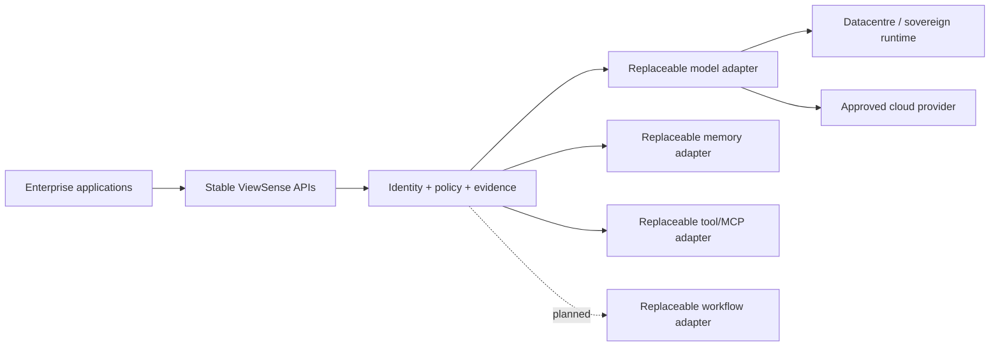

# ViewSense Objective and Principles

## Objective

Provide enterprises with a portable control layer for AI workloads that can operate disconnected, in a private data centre, in public cloud, or across approved combinations. An application should continue to use the same ViewSense API when an enterprise changes its model runtime, memory product, vector database, workflow engine, or MCP implementation.

## Non-negotiable principles

- **API first:** a capability is usable only through a versioned, documented contract. API first includes HTTP/JSON, SSE, MCP Streamable HTTP, and CloudEvents; it does not mean REST is forced onto streaming or event use cases.
- **Replace through contracts:** callers depend on capability contracts, never vendor SDKs. Adapters absorb vendor authentication, schemas, errors, and feature discovery.
- **Zero implicit trust:** network location does not grant access. Transport identity and application authorization are both required on every hop.
- **One owner per datum:** a service can own a schema/database, but cannot expose it to peers. Replication and analytics use explicit events or export APIs.
- **Tenant is derived identity:** external tenant headers are ignored. The edge derives tenant context from a verified identity and delegates it only to authorized workloads.
- **Policy before execution:** model selection, memory access, and tool use are policy decisions made before provider calls and recorded for audit.
- **Portable core, optional accelerators:** baseline installation uses standard Kubernetes APIs. Cloud-specific identity, GPU, storage, or ingress features are overlays.
- **Fail closed:** unknown providers, missing tenant context, expired identity, unavailable policy, and disallowed egress deny the operation.

These are production invariants. The reference foundation proves many of the boundaries but does
not yet enforce governance admission on live routes, provide general purpose/classification policy,
or ship native local-model, MCP, workflow, and telemetry adapters. It must not be promoted as a
production-complete implementation; see the conformance map for exact evidence.

## Target outcomes

- provider change without application change;
- no provider credential available to clients or the orchestrator;
- local inference and cloud inference selectable by tenant/data policy;
- memory export/import with a canonical envelope;
- independently scalable stateless gateways and provider runtimes;
- reproducible namespace-level installation, upgrade, rollback, backup, and removal.

These are acceptance targets. The shipped maturity for each capability is tracked in
[Implementation Conformance](../00-implementation-conformance.md).

## Explicit non-goals for the initial foundation

- training or fine-tuning models;
- inventing a proprietary model protocol when an OpenAI-compatible surface is sufficient;
- treating a vector index as authoritative business storage;
- executing unreviewed MCP servers in the control plane;
- claiming production compliance from development certificates or mock adapters.
