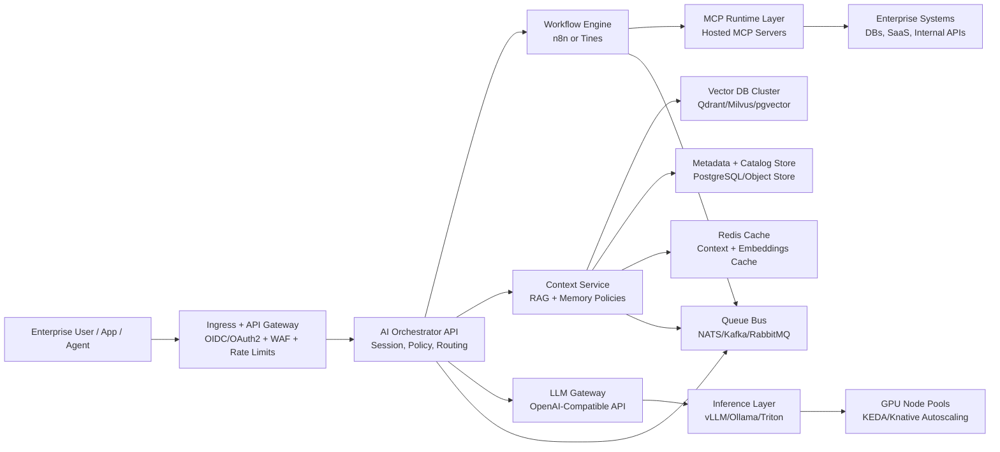

# Design 10.2 - Runtime Topology and Request Flow

## Runtime Topology

## End-to-End Request Flow

1. User or application authenticates via enterprise IdP and enters through API gateway.
2. Gateway validates token, tenant scope, and policy controls.
3. Orchestrator routes request by model, workflow, and policy.
4. Workflow engine executes deterministic logic and tool loops.
5. Context service performs retrieval and context assembly.
6. LLM gateway normalizes and routes inference request.
7. Inference layer streams response and returns control to orchestrator.
8. Async telemetry and persistence are emitted through queue and storage paths.

## Decoupling Constraints

- No direct cross-service database reads.
- API and event contracts only between domains.
- Async message bus for non-blocking side effects.
