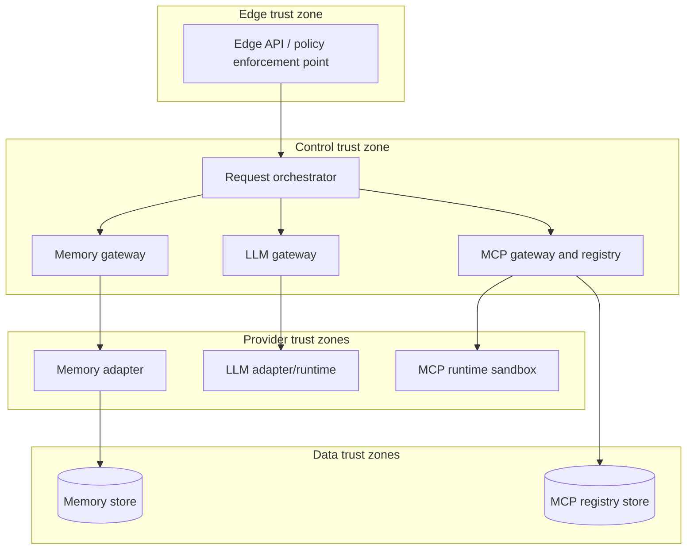

# ViewSense Runtime Topology and Flows

## Planes and trust boundaries

Kubernetes NetworkPolicy separates these zones even when they share a cluster. Production may place them in separate namespaces or clusters without changing API contracts.

## Synchronous response flow

1. The edge validates the external identity, derives `tenant_id`, applies request quotas, and rejects caller-supplied tenant overrides.
2. The edge obtains or reuses a short-lived token whose audience is only the orchestrator and whose scope is only `orchestrate.invoke`.
3. The orchestrator applies model, memory, tool, cost, and residency policy.
4. The memory gateway queries a selected memory provider; provider-specific identifiers do not escape the canonical response.
5. The LLM gateway selects an allowed route and calls an OpenAI-compatible local or cloud adapter.
6. Optional tool execution goes through the MCP gateway. The orchestrator never connects directly to an MCP server.
7. The response is returned with request/trace IDs and usage metadata. Memory writes and audit events are idempotent side effects.

## Failure rules

- One end-to-end deadline is subdivided into retrieval, inference, and tool budgets.
- Retries are allowed only for operations documented as idempotent and are bounded with jitter.
- Streaming responses are never transparently retried after bytes have been emitted.
- Provider fallback must satisfy the same tenant policy, data residency, model capability, and safety class; otherwise fail closed.
- Memory failure may degrade to no-memory only when tenant policy explicitly permits it.
- MCP failure never causes an unapproved alternate tool to execute.

## Asynchronous flow

Long ingestion, evaluation, and workflow jobs return `202 Accepted` plus an operation resource. Events use CloudEvents 1.0 envelopes, carry tenant and trace context, and contain references rather than sensitive prompt bodies by default. The event bus is not part of the current reference slice.

## Data ownership

| Owner | State | Access path |
|---|---|---|
| memory provider | canonical memory records and embeddings | memory provider contract through memory gateway |
| MCP gateway | server catalog, certification state, policy metadata | MCP administration API |
| workflow provider | durable workflow instances | workflow API (future slice) |
| identity system | clients, grants, keys | identity administration plane, never runtime APIs |

Direct cross-service SQL, shared writable volumes, and provider SDK calls from the orchestrator are prohibited.
