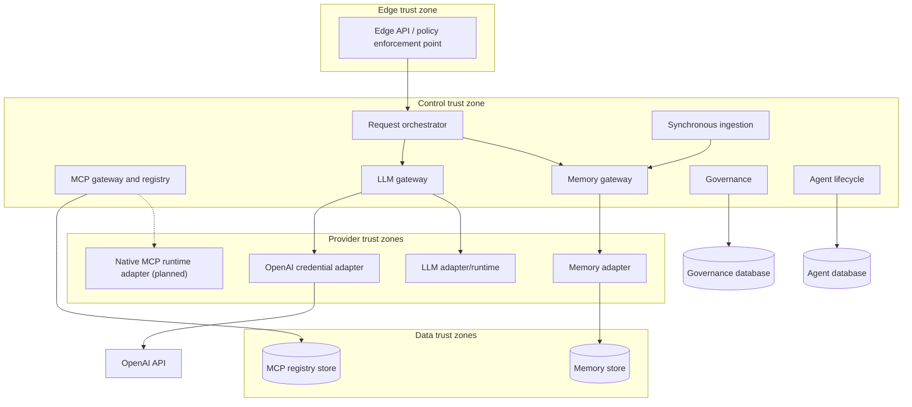
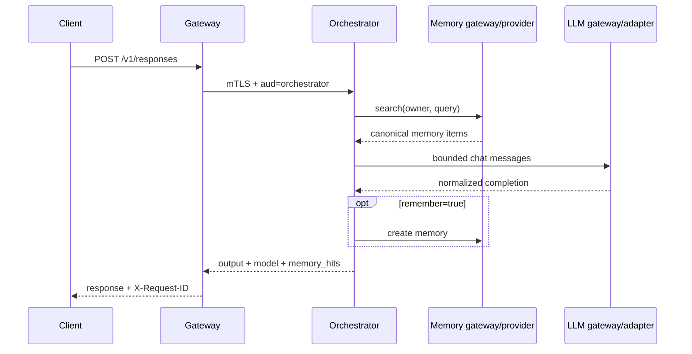

# ViewSense Runtime Topology and Flows

## Planes and trust boundaries

Solid arrows are implemented calls. Dashed arrows are target integrations and require a shipped
adapter plus conformance evidence.

Kubernetes NetworkPolicy separates these zones even when they share a cluster. Production may place them in separate namespaces or clusters without changing API contracts.

The current orchestrator does not invoke MCP, governance, ingestion, or the agent runtime. Those
services expose independent APIs. Native MCP transport, autonomous agent-to-tool execution, and
workflow callbacks are planned.

## Implemented synchronous response flow

1. The edge validates the development or external OIDC token, derives `tenant_id`, validates the
   request model, and rejects caller-supplied tenant overrides. Rate limits, WAF, and enterprise
   quotas belong to the production API-management integration.
2. The edge obtains or reuses a short-lived token whose audience is only the orchestrator and whose scope is only `orchestrate.invoke`.
3. The orchestrator performs bounded memory retrieval, constructs delimited context, and invokes the
   configured LLM route. General model/tool/cost/residency policy routing is target state.
4. The memory gateway enforces the tenant-bound provider call and queries the configured provider;
   provider-specific payloads do not escape the canonical response.
5. The LLM gateway forwards to one deployment-configured OpenAI-compatible adapter. Dynamic
   capability routing is not implemented.
   For OpenAI, it calls an internal ViewSense adapter using mTLS and a tenant-bound
   `provider.invoke` token. That adapter alone exchanges the server-held API key with the pinned
   OpenAI HTTPS API; callers cannot select the outbound host or provider model.
6. The response returns with a request ID, model identifier, and memory-hit count. When `remember` is
   true, the orchestrator writes the interaction through the memory gateway.

## Failure rules

- One end-to-end deadline is subdivided into retrieval, inference, and tool budgets.
- Retries are allowed only for operations documented as idempotent and are bounded with jitter.
- Streaming responses are never transparently retried after bytes have been emitted.
- Provider fallback must satisfy the same tenant policy, data residency, model capability, and safety class; otherwise fail closed.
- OpenAI authentication, rate-limit, timeout, and malformed-response failures are normalized and
  never include the upstream response body; no implicit fallback to the mock or another region occurs.
- Memory failure may degrade to no-memory only when tenant policy explicitly permits it.
- MCP failure never causes an unapproved alternate tool to execute.

## Target asynchronous flow

Long ingestion, evaluation, and workflow jobs will return `202 Accepted` plus an operation resource.
Events use CloudEvents 1.0 envelopes, carry tenant and trace context, and contain references rather
than sensitive prompt bodies by default. No event bus or long-operation API ships in the current
reference.

## Data ownership

| Owner | State | Access path |
|---|---|---|
| memory provider | canonical memory records and embeddings | memory provider contract through memory gateway |
| MCP gateway | server catalog, certification state, policy metadata | MCP administration API |
| workflow provider | durable workflow instances | workflow API (future slice) |
| identity system | clients, grants, keys | identity administration plane, never runtime APIs |

Direct cross-service SQL, shared writable volumes, and provider SDK calls from the orchestrator are prohibited.
