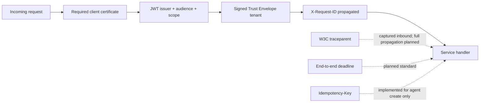

# ViewSense AI® API and Integration Standards

## Contract families

| Capability | Canonical interface | Notes |
|---|---|---|
| public AI response | `/v1/responses` HTTP/JSON | SSE is planned |
| model inference | OpenAI-compatible `/v1/chat/completions` subset | one configured adapter; capability discovery is planned |
| memory | `/v1/memories` and `/v1/memories/search` | vendor-neutral record envelope |
| MCP/tool governance | `PUT /v1/servers/{name}` and `POST /v1/tools/call` | current provider call is ViewSense AI®-owned; native MCP transport is planned |
| provider governance | `PUT/GET /v1/provider-passports/{name}`, evaluations, and `:admit` | admission is evaluated server-side |
| execution evidence | `/v1/evidence-events` | append-only API; identity derives tenant and producer |
| durable agent runs | `/v1/agent-runs`, `:resume`, `:cancel`, `/events` | idempotent create, optimistic version and ordered safe events |
| synchronous ingestion | `POST /v1/documents:ingest` | paragraph chunking and memory writes; no durable job resource yet |
| development identity | `POST /oauth2/token` | development-only client credentials and Trust Envelope minting |
| long operations | operation resources plus CloudEvents | planned |
| health | `/healthz` | must reveal no tenant/provider secrets |

FastAPI exposes runtime OpenAPI for implemented HTTP routes. Committed OpenAPI snapshots,
consumer-driven tests for every service, SSE, and CloudEvents are target gates, not current evidence.
The exact current route inventory is in
[Implementation Conformance](../00-implementation-conformance.md#implemented-http-surface).

The bundled OpenAI adapter implements the internal non-streaming chat-completions subset used by
the orchestrator. It accepts only text `system`, `user`, and `assistant` messages, discards
unrecognized outbound fields, selects the configured model server-side, and pins the upstream base
URL to `https://api.openai.com/v1`. This is an additive provider implementation; the public
`/v1/responses` contract is unchanged. The OpenAI profile defaults to server-controlled
`gpt-5.6-luna` from `config/models.env`; model changes are audited deployment configuration and
require representative quality, latency, safety, and cost evaluation rather than a caller-selected
field.

## Request context: implemented versus target

- `Authorization: Bearer …` with exact audience and least-required scope;
- mTLS workload identity on internal calls;
- identity-signed ViewSense AI® Trust Envelope v1 containing tenant, delegated caller, subject,
  purpose, classification, and request correlation;
- stable `X-Request-ID`; inbound `traceparent` is logged, while complete W3C propagation is planned;
- target use of `Idempotency-Key` for retriable creates and tool calls with declared idempotency;
- absolute deadline or remaining timeout budget.

The current slice implements token audience/scope, certificate-required TLS, signed tenant delegation, request ID,
provider passport/evaluation admission, optional OPA decisions, safe evidence APIs, and persistent
idempotency/version checks for agent runs. The agent events resource currently returns ordered JSON;
SSE and CloudEvents export are later compatible transports. SPIFFE identity binding, full trace propagation, and standardized
idempotency across every API remain next steps. The unsigned
`X-ViewSense-Tenant` header is rejected; it is not a compatibility mechanism.

External OIDC is terminated only at the edge. The verifier pins HTTPS issuer, JWKS, audience,
algorithms, required scopes, subject, and configured tenant claim. The edge then exchanges that
identity for an audience-specific internal token; internal services never accept the external human
token directly.

## Compatibility

- Additive optional fields are backward compatible.
- Removing/renaming fields, changing defaults, or narrowing accepted values requires a new major version.
- Unknown response fields must be ignored by consumers.
- Errors use a stable code, safe message, request ID, retryability, and optional field violations.
- Provider errors are normalized; raw vendor errors and credentials are never returned to clients.
- A deprecated major version has a published support window and telemetry-backed migration plan.

## Provider capability discovery

Each adapter must declare model/context limits, streaming, tool calling, structured output, embedding dimensions, memory filters, export/import, and residency attributes. Routing evaluates required capabilities before cost or latency. Silent feature emulation is prohibited when it changes safety or correctness.

## Security and data minimization

Schemas distinguish data from instructions. Retrieved memory is delimited as untrusted data. Logs default to metadata only; prompt, completion, memory, and tool payload capture requires an explicit classified policy. URLs supplied through administration APIs are HTTPS-only and exact-host allow-listed to prevent SSRF.
