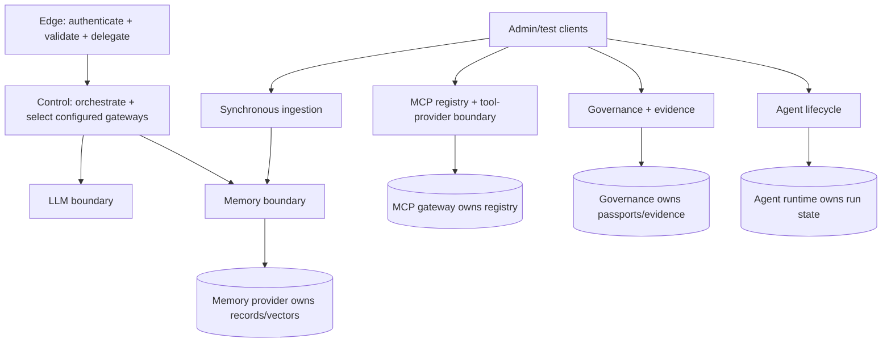

# ViewSense Component and Ownership Model

## Edge API

The implemented gateway validates development or external OIDC tokens, derives tenant context,
validates the public request schema, and delegates to the orchestrator. Enterprise rate limits,
quotas, WAF, and broad API compatibility are responsibilities of the target API-management layer.
The gateway does not select provider URLs, hold provider credentials, or implement agent loops.

## Request orchestrator

The implemented orchestrator retrieves owner-bound memory, delimits it as context, invokes the LLM
gateway, optionally writes the interaction, and assembles the response. Policy-based routing,
approved tool calls, and cost/residency decisions are target extensions. Long-running durable
business processes belong behind a workflow-provider API, not inside request handlers.

## LLM gateway

The implemented LLM gateway is a stateless, deployment-configured proxy to one adapter. The mock
and OpenAI adapters are executable. Capability discovery, aliases, multi-route policy, usage
normalization, and native vLLM/Ollama/Azure adapters are planned. Provider credentials belong only
to the owning adapter, not the LLM gateway. The gateway stores no conversation memory.

The bundled OpenAI adapter translates the internal mTLS/scoped-token request into an OpenAI Bearer
request. It owns the API key, exact upstream URL, configured model, outbound field minimization,
timeout, and safe error translation. It owns no memory: retrieved memory reaches it only as bounded
request context assembled by the orchestrator.

## Memory gateway and providers

The gateway verifies tenant delegation and exposes canonical create/search records. Rich
purpose/classification/retention policy is planned. The reference provider uses PostgreSQL/pgvector
with deterministic development embeddings. The executable Mem0 adapter keeps its API key,
tenant/owner pseudonymization, upstream paths, and response normalization inside the provider
boundary; live conformance requires a selected Mem0 installation.

Memory is split conceptually into:

- episodic/user memory;
- governed knowledge/RAG documents;
- short-lived request/session context.

These have different retention and authorization and must not be merged into one unclassified vector collection.

## MCP gateway and runtime

The implemented gateway owns a PostgreSQL server registry, exact HTTPS host allow-list, scoped
registration/invocation APIs, and a ViewSense-owned `/v1/tools/call` provider contract. The mock
provider proves isolation and invocation. Native MCP Streamable HTTP translation, certification,
per-tool policy, approval state, and immutable invocation audit are planned; the current registry
entry plus `enabled` flag is not production certification.

## Workflow provider (planned)

Durable workflow engines (Temporal, Argo Workflows, n8n, or an enterprise product) implement a workflow contract. The platform does not assume that a low-code engine is safe for autonomous tool loops. Workflow definitions are versioned artifacts with bounded execution and human approval points.

## Agent runtime and ingestion

The bundled online agent runtime is a persistent bounded state machine. It implements idempotent run
creation, optimistic versions, step/cost/tool budgets, checkpoint, approval/rejection, cancellation,
terminal states, and ordered event history in its own PostgreSQL database. It owns run/checkpoint
state but no provider data. Automatic plan/model/tool workers and external workflow adapters are not
yet implemented. The ingestion service owns document ingestion jobs and deterministic chunking;
parsing, enrichment, embeddings, and vector persistence remain replaceable stages.

## Identity and policy

Human identity federates through enterprise OIDC; the edge verifier supports generic OIDC and
Keycloak-compatible issuer/JWKS/claim mapping. Target workload identity uses SPIFFE/SPIRE, mesh
identity, or equivalent. The planned SPIRE integration consumes SVIDs through an SDS-capable
proxy/mesh rather than embedding SPIRE into application code. Provider admission uses
the built-in checks or a fail-closed OPA decision API; the chart can place OPA beside governance.
The repository's issuer and static PKI are development-only.

## Governance and evidence

The governance API owns provider passports, evaluation evidence, admission state, and safe
execution evidence. Providers cannot mark themselves admitted, and callers cannot choose an
evidence producer: both transitions are derived or enforced server-side. Its database is owned
and unreachable from other applications. Production policy engines, signature/transparency
verification, immutable evidence export, retention, and legal hold remain separate adapters and
maturity gates.

## Observability and audit

All application components emit JSON request/runtime logs and propagate `X-Request-ID`. Inbound
`traceparent` is recorded but not propagated across clients. Native OpenMetrics, distributed tracing,
OTLP export, audit delivery acknowledgement, and regulated fail-closed delivery are planned.
Governance evidence is payload-minimized and append-only at its API, but PostgreSQL is not an
immutable audit sink.

## Reference versus replaceable choices

| Capability | Reference slice | Replaceable examples |
|---|---|---|
| LLM provider | deterministic mock; OpenAI credential adapter | planned vLLM, Ollama, Azure OpenAI adapters |
| memory provider | PostgreSQL + pgvector; Mem0 adapter | Qdrant adapter, managed vector service |
| agent runtime | persistent bounded state machine | LangGraph-compatible adapter |
| MCP provider | ViewSense echo tool provider | planned native/certified enterprise MCP adapter |
| identity | local RSA token issuer | enterprise IdP + workload identity |
| governance/evidence | owned PostgreSQL reference | external policy and immutable evidence sinks |
| deployment | Kustomize development base | Helm/GitOps environment overlays |

## Repository module boundary

Runtime implementations remain small, independently deployable Python packages under `src/viewsense_*`; they are not nested inside deployment packaging. The `fabric/<capability>/` directories are the machine-readable installable catalog. Every capability directory contains a `module.json` descriptor and README that declare maturity, owned contracts, implementation paths, Helm selection paths, data ownership, and bundled/external provider choices. `fabric/module.schema.json` defines the descriptor format and the catalog conformance test rejects missing, undocumented, or dangling module entries.

This separation avoids coupling application source layout to Helm or a future operator while ensuring packaging folders are executable metadata rather than placeholders. A `contract-only` catalog entry is deliberately visible but cannot be represented as implemented; Helm and documentation must retain the same maturity statement.
