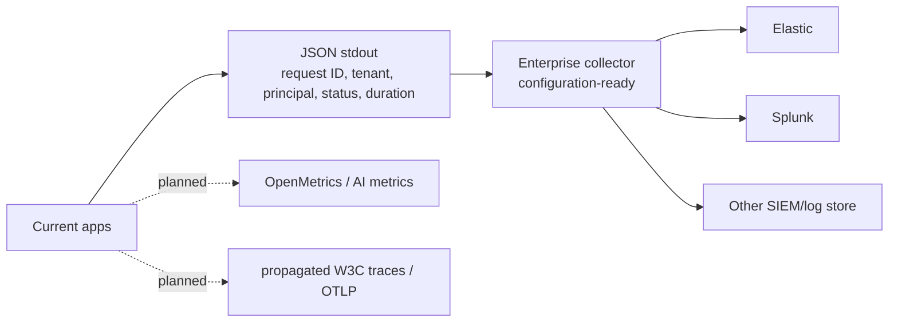
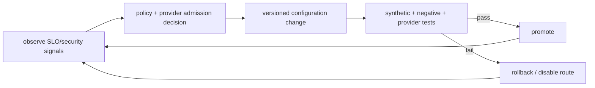

# ViewSense Day-2 Operations and SRE

## Observability: current and target

The implemented middleware emits one JSON object per request and propagates `X-Request-ID`.
It records an inbound `traceparent` value but the service client does not yet forward it. The
reference does not expose OpenMetrics or native OTLP. Production requires propagated traces,
tenant pseudonymization, route/provider and retry fields, RED/USE plus AI metrics, and a collector.
Prompt, completion, memory, and tool bodies remain excluded from baseline logs.

## SLOs and dependency budgets

Define SLOs separately for edge/control overhead, memory, each model route, and each MCP class. End-to-end alerts use multi-window error-budget burn. A provider outage must identify the dependency instead of presenting as generic orchestrator failure. Route changes and degraded no-memory operation are visible events.

## Release safety

- immutable signed image digests and GitOps promotion;
- contract tests against every configured adapter;
- expand/migrate/contract database changes with rollback compatibility;
- canary by non-sensitive synthetic tenant, then explicit pilot tenants;
- rollback on security regression, error-budget burn, latency, or output-quality gate;
- configuration rollout and application rollout independently reversible.

## Backup and disaster recovery

Each state owner defines RPO/RTO, encryption, retention, legal hold, restore order, and integrity verification. PostgreSQL uses PITR plus regular full backups. Vector records retain enough canonical source/embedding metadata to reindex. MCP catalog backups exclude retrievable secrets. Restore tests run monthly in an isolated environment; regional/cluster failover is exercised quarterly for required tiers.

The agent database is a separate state owner. Restore it before resuming workers, hold all restored
runs paused until version/idempotency reconciliation completes, and never infer that a side effect
must be repeated merely because an event is absent. Mem0 backup/export, Keycloak realm recovery,
SPIRE trust-bundle recovery, OPA bundle rollback, and workflow recovery remain owned by their
selected product operators and must be tested with the ViewSense conformance suite.

## Incident playbooks

- suspected cross-tenant retrieval: stop affected route, preserve audit evidence, revoke identities, assess all provider copies;
- compromised MCP connector: disable catalog entry, block egress, revoke connector credentials, inspect invocation history;
- provider credential leak: revoke at provider, rotate secret source, invalidate pods/tokens, check usage audit;
- token runaway: cancel request/workflow, enforce tenant stop-loss, quarantine route;
- model quality/safety regression: pin previous provider/model policy, preserve evaluation evidence, notify owners.

For an OpenAI route, 401/403 indicates credential/configuration failure and pages the route owner;
429 is a capacity/quota signal and must not cause residency-unsafe fallback; timeout/5xx consumes
the provider dependency budget. Rollback runs `make openai-disable` in development or promotes the
previous signed route configuration in production. Rotate/revoke the provider key at OpenAI first,
then synchronize the secret and restart only the adapter; verify callers and logs never contain it.
The local OpenAI model default is controlled by `config/models.env` and currently resolves to
`gpt-5.6-luna`. Changing that default requires replaying representative
memory-grounding, safety, latency, token-usage, and output-contract evaluations before promotion;
rollback restores the last admitted model value without changing the stable ViewSense API.

## Capacity and cost

Review GPU saturation, batching, KV-cache pressure, database index health, queue depth, connector external quotas, and tenant cost weekly. Enforce per-tenant concurrency, token, memory-storage, and tool budgets. Cost-based routing is evaluated only after capability, security, residency, and SLO constraints.

## Operational readiness gate

No production provider is enabled until it has ownership/on-call, dashboard and alerts, SLO, capacity test, failure-mode test, security review, data-flow record, backup/restore where stateful, credential rotation, and rollback/disable instructions.

Provider readiness is represented by an expiring passport plus evaluation/admission records. The
reference governance API evaluates admission, but gateways do not yet consult admission state when
routing and no expiry alert controller is shipped. Production must add that reconciliation/enforcement
loop, alert before expiry, block revoked/expired routes, back up governance state, and export evidence
to an independently administered immutable sink.

Database-owning services use bounded startup retries because Kubernetes readiness ordering does not
guarantee that a newly reachable database is accepting connections. Exhaustion fails startup and is
visible through JSON logs and readiness. Development rollouts restart services sequentially to avoid
an all-service surge on a small cluster; production availability strategy is defined by its overlay,
capacity budget, disruption budget, and tested rollback.

Trust Envelope failures are separated into missing context, unsupported version, tenant inconsistency, delegation denial, expired token, wrong audience, and insufficient scope. They are security signals and must not trigger fallback to an unsigned header or a less-restricted provider.

Product readiness is read from `fabric/product-catalog.json`: `validated` has repository evidence,
`configuration-ready` has an executable ViewSense integration boundary but needs the selected
environment, and `planned` is declaration-only. Render every profile with `make profile-check`.
Never report a profile as installed merely because Helm accepts its values.

## Operational control loop

