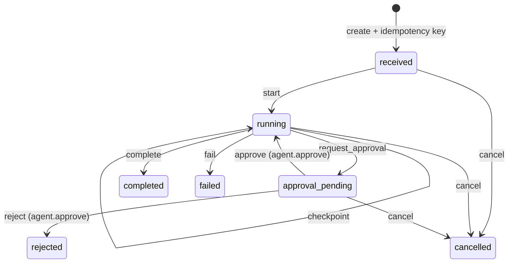
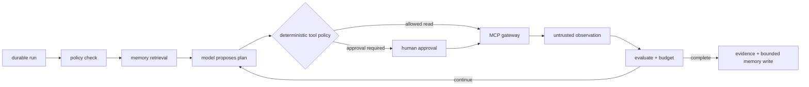
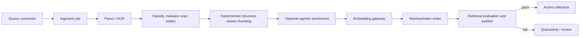

# ViewSense Agent Runtime, Ingestion, and Workflow Design

## Design decision

ViewSense treats “agentic” as a governed execution capability, not permission for a model to call arbitrary tools. It separates three replaceable capabilities:

1. **Online agent runtime:** bounded plan/act/observe execution for interactive or background goals.
2. **Ingestion pipeline:** resumable document processing that can use deterministic and AI-assisted stages before memory/index writes.
3. **Workflow provider:** durable business/event orchestration and human approvals through n8n, Temporal, Argo Workflows, or another adapter.

All three use APIs; none can directly read another service's database or receive all provider credentials.

## Implemented agent lifecycle

The shipped runtime is a durable lifecycle kernel operated through explicit API actions. It does not
call a model, retrieve memory, produce a plan, or invoke MCP. It persists tenant, creator, objective,
profile, state, optimistic version, step count, configured step/tool/cost ceilings, and safe ordered
events. Provider credentials and raw long-term memory do not belong in agent state.

## Target autonomous worker

This worker loop is planned; its diagram is an authorization model, not deployed behavior.

### Agent API contract

- `POST /v1/agent-runs` creates an idempotent run and returns a run resource.
- `GET /v1/agent-runs/{run_id}` reads current state.
- `POST /v1/agent-runs/{run_id}:resume` applies an authorized lifecycle transition.
- `POST /v1/agent-runs/{run_id}:cancel` moves a non-terminal run to cancelled.
- `GET /v1/agent-runs/{run_id}/events` returns ordered versioned state events; SSE is a compatible
  future transport.

Implementations such as a built-in state machine or LangGraph remain behind this contract. Durable state is mandatory for background runs and approval pauses. Side effects use idempotency keys and are recorded before/after execution to prevent replay after recovery.

The side-effect rule is a target invariant; the current lifecycle kernel does not execute side
effects.

### Target guardrails

- maximum steps, model calls, tool calls, wall time, tokens, cost, parallel branches, and observation size;
- per-tool read/write/destructive classification and argument policy;
- mandatory human approval for high-impact or irreversible actions;
- no tool discovered from prompt content becomes callable without catalog approval;
- tool output is untrusted data and cannot alter system policy;
- cancellation, checkpoint, retry, and compensation semantics per step;
- output/evidence evaluation before committing memory or side effects;
- complete model-route, policy-decision, approval, and MCP invocation audit.

The bundled reference now persists tenant-bound state transitions and approval actors in an ordered
run-event table and exposes them through the Agent API. The separate governance API implements the
payload-minimized Evidence Event v1 boundary. Exporting every agent event transactionally to that
evidence boundary, SSE streaming, autonomous plan/tool workers, and side-effect replay protection
remain next slices. Prompts, completions, memory, arguments, results, credentials, and personal data
are excluded from baseline events.

## Target governed ingestion pipeline

Chunking is a strategy provider. Target strategies include paragraph/basic, by-title/section,
by-page, table-aware, code-aware, and semantic similarity. Hard limits come from the selected
embedding/model capability. Overlap is explicit and versioned. The target pipeline retains the
original artifact and parsed element lineage so an index can be rebuilt without trusting old
vectors.

AI-assisted enrichment may add contextual prefixes, summaries, entities, questions, classifications, or relationship edges, but it runs after security classification and before embeddings. Generated enrichment is labelled, confidence-scored, provenance-linked, schema-validated, and never overwrites source text. Low-confidence or policy-sensitive output is quarantined. This prevents an LLM from silently corrupting enterprise knowledge.

### Ingestion API contract

- `POST /v1/ingestion-jobs` accepts a source reference, collection, strategy/config version, classification, and idempotency key.
- `GET /v1/ingestion-jobs/{id}` reports per-stage counts, failures, checkpoints, and safe diagnostics.
- `POST /v1/ingestion-jobs/{id}:cancel|retry|publish` controls lifecycle with authorization.
- events describe stage progress and dead-letter items; large artifacts use object references, not event payloads.
- re-ingestion uses content hashes and source versions to deduplicate and tombstone superseded chunks.

The current executable slice is smaller:

It is synchronous and writes only through the memory API. Durable jobs, parsers/OCR, malware scan,
classification/redaction, embedding gateway, enrichment, evaluation, quarantine, publish, source
artifact retention, and re-ingestion/tombstoning are planned.

## Planned workflow provider boundary

The target workflow gateway exposes versioned start/status/signal/cancel APIs and CloudEvents.
Provider adapters would translate these into n8n, Temporal, Argo Workflows, or another engine. No
workflow gateway, adapter, or callback implementation ships today; Helm workflow values record
selection intent only.

### When to use what

| Need | Preferred capability |
|---|---|
| interactive, stateful plan/tool loop | agent runtime such as a LangGraph adapter or built-in bounded graph |
| business SaaS integrations, triggers, low-code automation, approval channels | n8n adapter |
| long-lived mission-critical execution, timers, retries, compensation | Temporal adapter |
| Kubernetes batch/GPU/data pipeline jobs | Argo Workflows adapter |
| simple event fan-out | event bus/worker, not an agent |

n8n is valuable because of its connectors, AI/tool nodes, and human-review patterns, but n8n credentials stay in its provider boundary and every action still goes through ViewSense identity/policy/MCP rules. Workflow definitions are signed/versioned; production execution data is redacted and retention-controlled.

## Complete modular product suite

| Capability | Required contract | Example product class |
|---|---|---|
| edge/API management | OpenAPI, OIDC, quotas, WAF | enterprise gateway/ingress |
| identity/policy/secrets | OIDC/JWKS, workload identity, policy API | enterprise IdP, SPIFFE/mesh, OPA, Vault |
| model gateway/inference | OpenAI-compatible plus capabilities | mock/OpenAI now; vLLM/Ollama adapters planned |
| embeddings/reranking | provider-neutral embedding/rerank APIs | local sentence-transformer or cloud adapter |
| memory/RAG | canonical memory, export/import, filters | PostgreSQL/pgvector, Mem0, Qdrant-class adapter |
| ingestion | parse/OCR/chunk/enrich/evaluate contracts | built-in workers or Unstructured-class adapter |
| object/catalog data | S3-compatible artifacts plus governed metadata | enterprise object store and catalog |
| agent runtime | run/checkpoint/approval/event contract | built-in graph or LangGraph-class adapter |
| workflows | start/status/signal/cancel contract | n8n, Temporal, Argo Workflows |
| tools/connectors | governed tool/MCP gateway/runtime | ViewSense mock now; native MCP adapter planned |
| evaluation/guardrails | dataset/run/score/promotion contract | offline and online evaluation providers |
| observability/SIEM | JSON, OpenMetrics, OTLP, audit events | enterprise collector to Elastic/Splunk/etc. |
| operations/FinOps | SLO, usage, quota, chargeback APIs | enterprise dashboards, ITSM, cost systems |

Selection order is security/residency → capability/quality → reliability/operability → cost. Product names stay in Helm/operator provider configuration; callers see only ViewSense contracts.

## Operator roadmap

Helm installs chosen modules. A future ViewSense operator should reconcile custom resources such as `ModelProvider`, `MemoryProvider`, `MCPServer`, `WorkflowProvider`, `AgentProfile`, and `IngestionPipeline`; validate conformance/certification; roll credentials; publish readiness; and block incompatible or policy-violating provider changes. It must not become a second workflow engine or store provider secrets in status.
