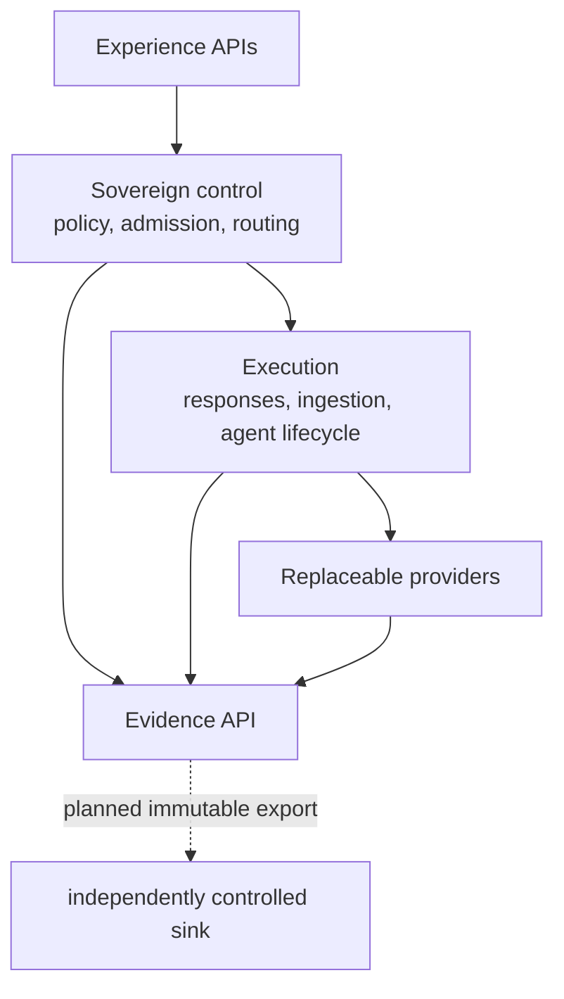
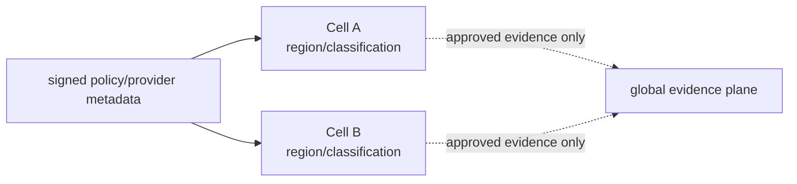

# ViewSense Sovereign Control and Evidence Fabric

## Product position

ViewSense is a sovereign AI control fabric. It does not compete with model, memory, workflow, or observability products; it owns the portable trust, policy, admission, routing, and evidence layer that keeps those products replaceable.

## Target planes

| Plane | Responsibilities | Durable owner |
|---|---|---|
| experience | responses, agents, workflows, ingestion, administration | contract metadata only |
| sovereign control | provider passports, policy, evaluation admission, routing, operator reconciliation | governance service |
| execution | bounded agents, durable workflows, knowledge compilation | capability-specific service |
| provider | models, embeddings, memory, MCP, remote agents | selected provider |
| evidence | lineage, route rationale, approvals, policy decisions, safe execution events | governance/evidence service initially; separable at scale |

## Trust Envelope v1

Caller-selected tenant headers are prohibited. The development issuer signs a versioned context into each audience token containing tenant, delegating workload, subject, purpose, classification, and request correlation. A workload may request a delegated tenant only when its client registration grants delegation. Fixed-tenant clients cannot request another tenant. Receivers reject a missing/malformed envelope and any legacy `X-ViewSense-Tenant` header.

Production replaces the development issuer with enterprise token exchange/workload identity while retaining the claims contract. Each hop may narrow purpose, classification, deadline, and scopes but cannot widen authority. Token caches are partitioned by the complete security context.

## Provider Passport v1

A provider passport is a versioned, expiring catalog resource for LLM, embedding, memory, MCP, workflow, agent, or ingestion providers. It declares HTTPS endpoint, protocols, capabilities, residency, accepted data classifications, operational owner, image digest, SBOM/provenance references, and status. It is descriptive evidence, not permission by itself.

Admission evaluates a passport against required capabilities, allowed residency, permitted classifications, expiry/revocation, and named evaluation evidence. The reference governance API stores passports, evaluation records, admissions, and append-only payload-minimized evidence events in its owned PostgreSQL database. Production adds signature verification, external policy decisions, immutable/WORM evidence export, and admission-controller enforcement.

The current LLM, memory, and MCP gateways do not consult the governance database during routing.
Connecting admitted state to route reconciliation is planned; an admission record is therefore
evidence, not yet a live traffic switch.

## Evidence and lineage

Evidence events record run ID, event type, producer, policy/config versions, artifact references, outcome, and safe metadata. Raw prompts, completions, memory, tool arguments/results, credentials, and personal data are prohibited. Events are append-only at the API. An export adapter can map ingestion runs/datasets to OpenLineage and execution spans to OpenTelemetry GenAI conventions.

The initial governance database is an executable reference, not the final immutable audit sink. Regulated profiles require delivery acknowledgement or fail-closed policy, integrity proofs, retention/legal hold, clock assurance, and independent access control.

## Future interoperability

- OpenAPI/AsyncAPI for ViewSense contracts and events;
- OpenAI-compatible model calls with explicit capability negotiation;
- MCP behind the governed tool gateway;
- A2A adapter for remote agent discovery and collaboration;
- CloudEvents for long-running lifecycle events;
- Kubernetes Gateway API Inference Extension for local model-aware routing;
- SLSA/in-toto-style provenance and signed OCI artifacts;
- OpenLineage facets for knowledge compilation and re-indexing;
- OpenTelemetry GenAI conventions through a versioned internal mapping.

External protocol support never bypasses the Trust Envelope, provider admission, policy, budgets, or evidence requirements.

## Agent flight recorder

The reference durable agent kernel now persists idempotent runs, versions, budgets, checkpoints,
approvals, cancellations, terminal outcomes, and ordered safe events. It does not yet execute model
plans or tools. The future flight recorder adds plan hashes, before/after side-effect evidence,
transactional governance export, and replay reconstruction without replaying side effects.

## Sovereign cells

A cell is an independently operable Kubernetes installation bound to a region, classification, or business unit. It keeps payload data and provider credentials local while accepting signed policy/provider metadata and exporting only approved evidence. Future profiles cover offline bundles, federated discovery, remote attestation, confidential runtimes, cell failover, and cryptographic configuration promotion.

Sovereign cells are target state; the repository ships one development namespace only.

## Non-goals

- replacing enterprise IdP, SIEM, workflow UI, vector database, or model server;
- allowing agents to acquire permissions from model output;
- global fallback that violates residency or classification;
- claiming compliance from documentation or manifest presence alone;
- representing a planned provider selector as an installed capability.

## Maturity statement

Executable foundation: Trust Envelope v1, provider passport/evaluation/evidence APIs, PostgreSQL ownership, JSON logs, mTLS/scoped tokens, reference model/memory/MCP/ingestion paths, bounded durable agent lifecycle, Kubernetes packaging, and smoke tests.

Partial/contract-only: autonomous agent workers, workflow adapters, signed third-party passports,
immutable evidence export, evaluation datasets/runners, A2A, multi-cluster cells, confidential
computing, full OTel/OpenLineage, and production provider certification. OPA and external OIDC have
executable integration points but require enterprise conformance and operations evidence.
