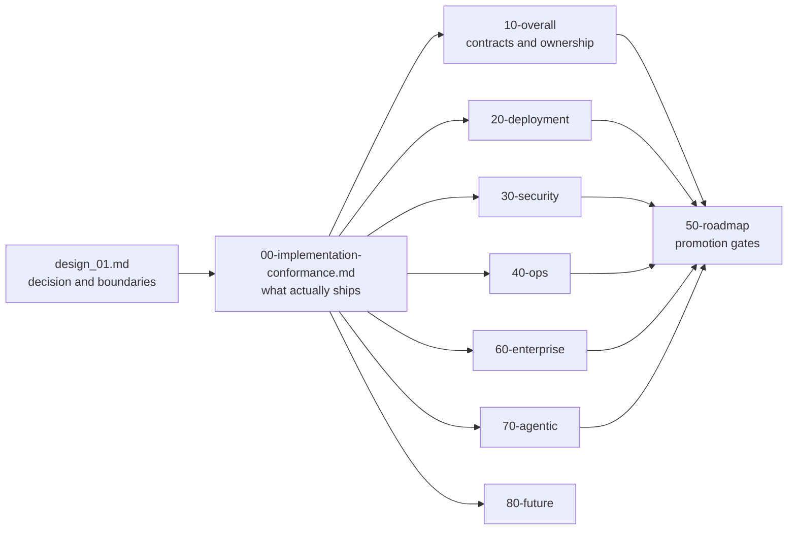

# ViewSense AI® High-Level Design

This directory is the canonical architecture set for ViewSense AI®. Read the index, then the executable
conformance map before using a target-state document as an implementation claim.

- [Architecture index](design_01.md)
- [Implementation conformance](00-implementation-conformance.md)

Architecture changes are major changes under `docs/prompts/governance/major-change-policy.md`. They require synchronized code, contract, security, deployment, and operations updates.

The canonical deployment target is Kubernetes. Docker Compose is a developer harness and cannot be used as evidence that Kubernetes isolation, probes, storage, or policy controls work.

Enterprise SSO, observability/SIEM, governance, lifecycle, resilience, and integration requirements are consolidated in `60-enterprise/01-enterprise-integration-controls.md`.

Agent execution, governed data ingestion/chunking, and n8n or other workflow-engine integration are defined in `70-agentic/01-agent-runtime-ingestion-workflows.md`.

Trust Envelopes, provider passports, evaluation admission, safe evidence, future A2A interoperability, and sovereign cells are defined in `80-future/01-sovereign-control-evidence-fabric.md`.

Cloud model integration is represented by a credential-owning provider adapter, never by placing
vendor keys in the edge, orchestrator, or generic LLM gateway. The OpenAI reference path and its
development/production egress distinction are described across the runtime, security, deployment,
and operations documents above.
