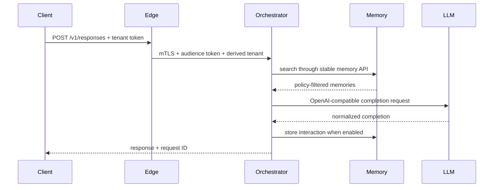

# ViewSense Architecture Index

## Decision

ViewSense is an API-first, Kubernetes-native AI backbone, not a bundled AI product. It owns policy, routing, orchestration, audit context, and stable contracts. Model, memory, workflow, and MCP implementations are providers behind those contracts.

## System boundaries

| Plane | Responsibility | Must not own |
|---|---|---|
| Edge | client authentication, quotas, request validation, public API | orchestration logic or provider credentials |
| Control | orchestration, routing policy, provider catalog, MCP policy | provider databases or model runtime internals |
| Provider | LLM inference, memory implementation, MCP execution | tenant authentication policy or public routing |
| Data | storage owned by exactly one service/provider | cross-service tables or direct consumer access |
| Security/operations | identity, policy decisions, secrets, telemetry, audit | business workflow semantics |

## Mandatory invariants

1. All capabilities have versioned network contracts and machine-readable schemas.
2. Each stateful domain owns its database; other domains use its API.
3. Every request is authenticated, authorized, encrypted, tenant-scoped, and traceable at every hop.
4. Provider selection is configuration/policy, never compiled into a caller.
5. An adapter must pass the same contract suite before it can replace another provider.
6. Kubernetes is the canonical packaging model; local Compose must preserve the same service boundaries.
7. A provider failure is contained by deadlines, bounded retries, circuit breaking, and no implicit fallback across data-residency classes.

## Reference request path

## Design set

1. [Objective and principles](10-overall/01-objective-principles.md)
2. [Runtime topology and flows](10-overall/02-runtime-topology-flow.md)
3. [API and integration standards](10-overall/03-api-integration-standards.md)
4. [Component and ownership model](10-overall/04-component-breakdown.md)
5. [Operations baseline](10-overall/05-operations-and-roadmap.md)
6. [Kubernetes deployment and sizing](20-deployment/01-deployment-topology-sizing.md)
7. [Zero-trust security model](30-security/01-zero-trust.md)
8. [Day-2 operations](40-ops/01-day2-operations-sre.md)
9. [Roadmap and maturity](50-roadmap/01-roadmap-maturity.md)
10. [Enterprise integration and control matrix](60-enterprise/01-enterprise-integration-controls.md)
11. [Agent runtime, ingestion, and workflow design](70-agentic/01-agent-runtime-ingestion-workflows.md)

## Implemented reference slice

The current code proves edge-to-orchestrator-to-memory/LLM flow, MCP registration/invocation, mTLS, scoped tokens, database ownership, provider host allow-listing, network segmentation, and Kubernetes deployment. Streaming, enterprise identity federation, external policy engines, durable workflow execution, full OpenTelemetry, HA, backups, and real provider adapters remain roadmap work and are not represented as complete.
