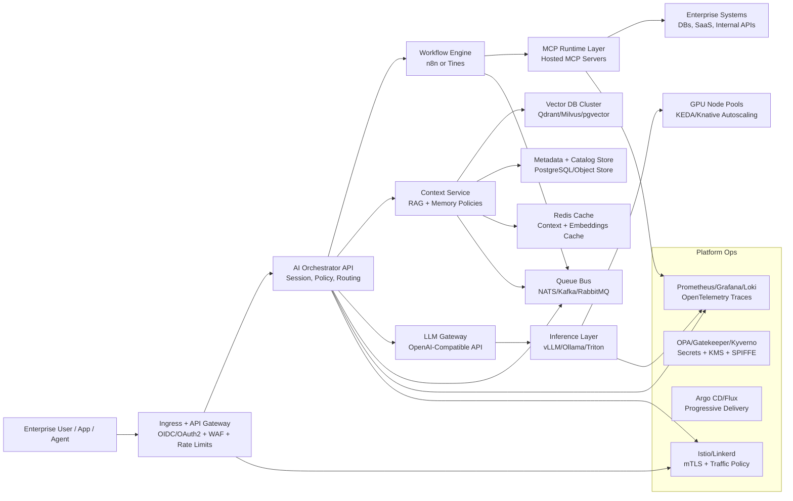

# LatticeCore® Platform on Kubernetes - Technical System Design 01

## 1. Objective and Scope

This document defines a production-grade, plug-and-play, infrastructure-agnostic enterprise AI platform, branded as LatticeCore® Platform, fully hosted on Kubernetes. The platform centralizes model hosting, memory/context management, MCP server runtime, workflow orchestration, and cloud-native governance into a single control and data plane architecture deployable to EKS, GKE, AKS, and bare metal clusters.

### Primary Non-Functional Targets

- Multi-tenant isolation: hard logical isolation with optional physical isolation per tenant and workload class.
- Availability: target 99.9%+ for control plane APIs and 99.5%+ for inference path (SLO-adjusted per model tier).
- Latency: p95 end-to-end assistant response under agreed token budget and context size constraints.
- Compliance: auditable data flow, immutable deployment history, policy-as-code guardrails.
- Portability: no cloud lock-in at core runtime layer.

## 2. Architectural Blueprint

### 2.1 High-Level Runtime Topology

### 2.2 End-to-End Request and Data Flow

1. Client authenticates with enterprise IdP via OIDC and reaches ingress/API gateway.
2. Gateway enforces JWT validation, tenant scoping, quota, and request shaping.
3. Orchestrator resolves tenant policy, model routing policy, and workflow template.
4. Workflow engine executes business logic and agent loops; invokes MCP tools where needed.
5. Context service performs RAG pipeline: retrieve metadata, vector search, rerank, compose context.
6. LLM gateway normalizes OpenAI-compatible request and routes to selected model backend.
7. Inference layer streams tokens back through orchestrator; workflow may perform tool follow-up cycles.
8. Conversation artifacts, telemetry, and memory updates are persisted asynchronously through queue bus.
9. Full traces, metrics, and audit events are emitted for observability and governance.

## 3. Component Breakdown and Technical Choices

## 3.1 Layer 1 - LLM Hosting and Inference

### Recommended Pattern

- Primary runtime: vLLM for high-throughput transformer serving and paged attention efficiency.
- Complementary runtime:
  - Triton for mixed model portfolios and ensemble pipelines.
  - Ollama for low-friction private/team-local model packaging where required.
- Front door: OpenAI-compatible gateway abstraction to decouple client integrations from backend runtimes.

### Kubernetes Design

- GPU node pools separated by profile (L4/A10/A100/H100 class).
- Runtime classes and taints/tolerations to pin model classes to approved nodes.
- Model serving deployed as per-model or per-family Deployments/StatefulSets.
- Model artifact pull via OCI/object storage with signed provenance.

### Scaling Strategy

- KEDA for event-driven autoscaling based on queue depth, QPS, token/sec, and GPU utilization.
- Knative for scale-to-zero for infrequent private endpoints where cold-start tolerance exists.
- Horizontal + vertical tuning:
  - HPA/KEDA for replica count.
  - GPU memory-aware admission policies.
  - Optional multi-instance GPU (MIG) slicing for fractional allocation.

### State, Caching, and Queueing

- Stateless inference pods; model weights mounted from read-only artifact cache or local NVMe cache.
- Redis as hot cache for prompt templates, tokenizer artifacts, and response fragments.
- Queue bus (NATS/Kafka) for async jobs: batch inference, embedding generation, evaluation runs.

### Why this works

- vLLM maximizes throughput per GPU for mainstream LLM inference.
- Triton broadens support for non-LLM and ensemble serving patterns.
- OpenAI-compatible API preserves ecosystem compatibility.

## 3.2 Layer 2 - AI Memory and Context Layer

### Core Services

- Context API: central service for retrieval, memory policy, chunking, and session assembly.
- Embedding service: model-agnostic embedding generation with versioned embedding schemas.
- Retrieval pipeline: hybrid retrieval (dense + sparse + metadata filter) with optional reranker.

### Storage Design

- Vector DB options:
  - Qdrant: strong filtering + operational simplicity.
  - Milvus: high-scale distributed vector workloads.
  - pgvector: simplified ops when PostgreSQL footprint already exists.
- Metadata store: PostgreSQL for canonical memory catalog and lineage metadata.
- Blob/object store: original documents, parsed chunks, and enrichment artifacts.

### Memory Model

- Multi-scope memory:
  - User memory (preferences, profile).
  - Team/tenant memory (playbooks, domain knowledge).
  - Global enterprise memory (approved corpora).
- Versioned embeddings and reindex pipelines to prevent drift during model upgrades.

### Caching and Consistency

- Redis for retrieval result cache, embedding dedupe cache, and short-lived session context.
- Write-behind/event-driven indexing to avoid blocking user request path.
- Idempotent ingestion pipeline using job keys and deterministic chunk IDs.

### Why this works

- Separating vectors, metadata, and blobs improves lifecycle governance and portability.
- Hybrid retrieval with strict metadata filtering enables secure enterprise-grade RAG.

## 3.3 Layer 3 - Hosted MCP Server Layer

### Runtime Architecture

- MCP Control Plane:
  - MCP registry, package installer, policy engine, credential broker.
- MCP Data Plane:
  - Isolated MCP server workloads per connector class and trust zone.
  - Standardized sidecars for telemetry, auth token exchange, and policy checks.

### Security Model

- Workload identity (SPIFFE/SPIRE or cloud workload identity) for service-to-service auth.
- Short-lived credentials from Vault/Secrets Manager; no static long-lived secrets in pods.
- Fine-grained ABAC/RBAC on tool invocation: who can call which MCP server, with which arguments.
- Network policies + service mesh authorization policies to restrict east-west access.

### Operations Model

- MCP server lifecycle managed via GitOps bundles (versioned manifests/Helm).
- Certification workflow for new MCP connectors:
  - Static policy checks.
  - Security scanning.
  - Contract and latency tests.

### Why this works

- Native hosted MCP allows dynamic tool access while preserving central enterprise control.
- Isolated runtimes reduce blast radius and improve compliance posture.

## 3.4 Layer 4 - Enterprise Workflow Engines

### Orchestration Pattern

- n8n/Tines handles deterministic orchestration, approvals, retries, timers, and external integrations.
- AI Orchestrator invokes workflows synchronously for interactive paths and asynchronously for long-running paths.
- Agent loops controlled by policy:
  - Max tool calls.
  - Budget/token caps.
  - Timeout ceilings.

### State Management

- Workflow state in engine-native store (PostgreSQL recommended for durability).
- Conversation/session state in orchestrator DB + Redis short-term cache.
- Outbox pattern for guaranteed event delivery to queue bus.

### Queueing Requirements

- NATS JetStream for low-latency eventing and simple ops.
- Kafka where replay-heavy analytics and large-scale event retention are mandatory.
- DLQ queues for failed tool invocations and enrichment tasks.

### Why this works

- Separating business workflow from model inference reduces coupling and eases governance.
- Explicit state transitions improve auditability and operational recovery.

## 3.5 Layer 5 - Cloud-Native Foundation

### Multi-Cloud Kubernetes Baseline

- Deployment targets: EKS, GKE, AKS, and CNCF-conformant bare-metal distributions.
- GitOps with Argo CD or Flux:
  - App-of-apps or fleet model.
  - Environment overlays using Kustomize/Helm.
  - Promotion via signed commits and policy checks.

### Traffic and Identity

- Ingress/API edge: NGINX/Envoy Gateway with OAuth2/OIDC integration.
- Service mesh: Istio (rich traffic policy) or Linkerd (operational simplicity).
- mTLS mandatory for in-cluster service communication.

### Policy and Governance

- OPA/Gatekeeper or Kyverno for admission policy enforcement.
- SBOM, image signing (Cosign), and signature verification at admission.
- Namespace per tenant or per business domain with resource quotas and limit ranges.

### Why this works

- Cloud-agnostic Kubernetes primitives plus GitOps provide repeatable enterprise deployment.
- Mesh and policy stack provide consistent zero-trust controls across environments.

## 4. Day-2 Operations Plan

## 4.1 Security and Isolation

- Identity and access:
  - OIDC federation with enterprise IdP.
  - RBAC mapped to tenant roles (admin, developer, auditor, operator).
  - ABAC for data classification and tool invocation scope.
- Data isolation:
  - Tenant-scoped namespaces, network policies, and storage partitions.
  - Encryption at rest using KMS-managed keys.
  - TLS/mTLS in transit across all paths.
- Secrets and key management:
  - Vault/External Secrets Operator with rotation policies.
  - Just-in-time credentials for MCP connectors and databases.
- Supply chain:
  - Signed container images, SBOM attestation, vulnerability gating.

## 4.2 Observability and AI Telemetry

- Metrics:
  - Prometheus scrape for platform + app + model metrics.
  - Golden signals plus AI-specific KPIs: tokens/sec, prompt latency breakdown, retrieval hit rate, hallucination proxy indicators.
- Logs:
  - Structured logs to Loki/ELK with tenant and trace correlation IDs.
- Traces:
  - OpenTelemetry end-to-end traces across gateway, workflow, MCP calls, retrieval, and inference spans.
  - Span attributes include model/version, prompt template version, tool call IDs, and cache hit/miss.
- Dashboards and alerting:
  - Grafana SLO dashboards by tenant, model family, and workflow.
  - Burn-rate alerting for latency/error budgets.

## 4.3 Reliability, HA, and Failover

- Control plane HA:
  - Multi-replica stateless services across zones.
  - PDBs, anti-affinity, and topology spread constraints.
- Data plane HA:
  - Replicated vector DB and metadata DB with automated failover.
  - Redis in HA mode (Sentinel or managed equivalent).
- DR strategy:
  - Cross-region backups and point-in-time recovery for PostgreSQL.
  - Object store versioning and replication.
  - Tested restore runbooks with RTO/RPO targets per tier.
- Progressive delivery:
  - Canary or blue/green for model runtime and orchestration services.
  - Automatic rollback on SLO regression.

## 5. Reference Deployment Blueprint

### Namespaces (example)

- ai-edge (ingress, API gateway, auth components)
- ai-control-plane (orchestrator, policy, MCP registry)
- ai-inference (vLLM/Triton/Ollama workloads)
- ai-memory (vector DB, metadata services, embedding services)
- ai-workflows (n8n/Tines + worker pools)
- ai-observability (Prometheus, Grafana, Loki, OTel collector)
- ai-security (Vault, policy controllers, admission controls)

### Suggested State Stores

- PostgreSQL: metadata, workflow durable state, config registry.
- Vector DB: semantic indexes and embeddings.
- Redis: hot cache, rate-limit cache, ephemeral session context.
- Object store: document corpus, model artifacts, trace archives.
- Queue bus: asynchronous orchestration, ingestion, and replay events.

## 6. Repository Structure Assessment

The current repository structure is directionally good for an enterprise platform blueprint:

- docs/design/high-level is appropriate for architecture documentation.
- prompts supports reusable AI interaction templates.
- fabric/charts supports Helm chart packaging.
- fabric/mcp-registry aligns with hosted MCP lifecycle management.
- fabric/memory and fabric/workflows map well to core platform domains.

### Recommended Improvements

1. Standardize design docs under one root (`docs/design/...`) to avoid split locations.
2. Add `platform/` or `infra/` for GitOps manifests (Argo CD/Flux apps, Kustomize overlays, policy bundles).
3. Add `fabric/observability/` for dashboards, alert rules, and OTel collector config.
4. Add `fabric/security/` for OPA/Kyverno policies, RBAC templates, and secret management references.
5. Add `runbooks/` for Day-2 operational procedures (incident response, failover, scaling).

## 7. Initial Implementation Roadmap (Condensed)

1. Foundation: GitOps bootstrap, ingress/auth, service mesh, baseline policies.
2. Inference: deploy vLLM stack with OpenAI gateway and KEDA autoscaling.
3. Memory: deploy vector DB + metadata service + ingestion/retrieval pipeline.
4. MCP: establish hosted MCP registry/runtime with isolated connectors.
5. Workflows: integrate n8n/Tines with orchestrator and queue bus.
6. Day-2: observability, SLOs, DR drills, security hardening and compliance evidence.

---

This design is intended as the baseline high-level architecture. A next document should define exact cluster sizing, GPU capacity models, tenancy patterns (soft vs hard isolation), and environment-specific manifests for EKS/GKE/AKS/bare-metal profiles.