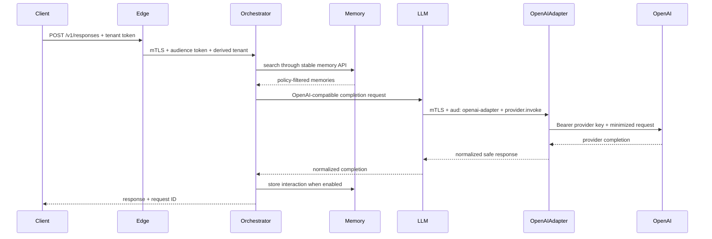

# ViewSense Architecture Index

## Decision

ViewSense is an API-first, Kubernetes-native sovereign AI control and evidence fabric with a small
portable reference suite. It owns portable trust envelopes, provider admission, policy, routing,
bounded agent state, safe evidence context, and stable contracts. Model, memory, workflow, identity,
policy, and MCP products remain replaceable behind those contracts.

Product packaging uses four explicit modes: `bundled`, `adapter`, `managed-dependency`, and
`external`. A bundled component is installed and tested with ViewSense; an adapter is installed but
its upstream product is separate; a managed dependency is installed/operated at platform scope; an
external product is reached through an API. Product selection never implies product installation.

Implementation truth is maintained in
[Implementation Conformance](00-implementation-conformance.md). Target-state requirements in this
design are not evidence that a capability is deployed.

## System boundaries

| Plane | Responsibility | Must not own |
|---|---|---|
| Edge | client authentication, quotas, request validation, public API | orchestration logic or provider credentials |
| Control | orchestration, routing policy, provider catalog, MCP policy | provider databases or model runtime internals |
| Provider | LLM inference, memory implementation, MCP execution | tenant authentication policy or public routing |
| Data | storage owned by exactly one service/provider | cross-service tables or direct consumer access |
| Security/operations | identity, policy decisions, secrets, telemetry, audit | business workflow semantics |
| Governance/evidence | provider passports, evaluations, admissions, safe lineage events | provider payload data or execution credentials |

## Mandatory target invariants

1. All capabilities have versioned network contracts and machine-readable schemas.
2. Each stateful domain owns its database; other domains use its API.
3. Every request is authenticated, authorized, encrypted, tenant-scoped, and traceable at every hop.
4. Provider selection is configuration/policy, never compiled into a caller.
5. An adapter must pass the same contract suite before it can replace another provider.
6. Kubernetes is the canonical packaging model; local Compose must preserve the same service boundaries.
7. A provider failure is contained by deadlines, bounded retries, circuit breaking, and no implicit
   fallback across data-residency classes. The reference implements bounded client timeouts and no
   implicit fallback; retry/circuit-breaker policy remains a production integration.

## Reference request path

## Design set

1. [Implementation conformance](00-implementation-conformance.md)
2. [Objective and principles](10-overall/01-objective-principles.md)
3. [Runtime topology and flows](10-overall/02-runtime-topology-flow.md)
4. [API and integration standards](10-overall/03-api-integration-standards.md)
5. [Component and ownership model](10-overall/04-component-breakdown.md)
6. [Operations baseline](10-overall/05-operations-and-roadmap.md)
7. [Kubernetes deployment and sizing](20-deployment/01-deployment-topology-sizing.md)
8. [Zero-trust security model](30-security/01-zero-trust.md)
9. [Day-2 operations](40-ops/01-day2-operations-sre.md)
10. [Roadmap and maturity](50-roadmap/01-roadmap-maturity.md)
11. [Enterprise integration and control matrix](60-enterprise/01-enterprise-integration-controls.md)
12. [Agent runtime, ingestion, and workflow design](70-agentic/01-agent-runtime-ingestion-workflows.md)
13. [Sovereign control and evidence fabric](80-future/01-sovereign-control-evidence-fabric.md)

## Implemented reference slice

The current code proves edge-to-orchestrator-to-memory/LLM flow, a credential-isolated OpenAI
adapter, PostgreSQL/pgvector and Mem0
memory boundaries, MCP registration/invocation, persistent bounded agent lifecycle, signed Trust
Envelope tenant delegation, external OIDC validation, built-in or OPA admission, append-only safe
evidence events, mTLS, scoped tokens, database ownership, provider host allow-listing, network
segmentation, and Kubernetes deployment. The OpenAI adapter is configuration-ready and its live
test requires a customer key; the deterministic mock remains the default regression provider.
When the OpenAI adapter is selected, its local default model comes from the non-secret
`config/models.env` and is currently `gpt-5.6-luna`; callers cannot override that server-controlled
route through the public request model field.
Keycloak and SPIRE are documented managed integrations;
their operators are not bundled. Autonomous agent workers, workflow adapters, cryptographic
third-party passport verification, immutable evidence export, full OpenTelemetry, HA, backups, and
provider certification remain roadmap work and are not represented as complete.
