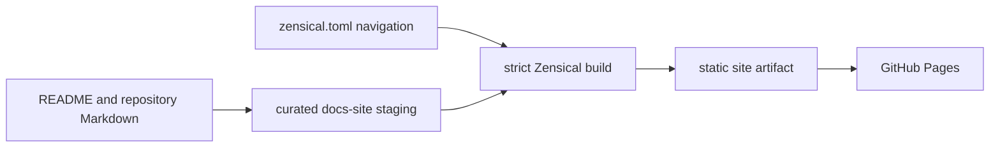

# Publishing the ViewSense AI® Documentation

The root `README.md` is both the GitHub repository introduction and the documentation-site home
page. Other published pages remain in their existing repository locations; the build copies only
the curated files listed in `scripts/build-docs.sh` into an ignored staging directory.



## Local build

```bash
python3 -m venv .venv-docs
.venv-docs/bin/python -m pip install --requirement requirements-docs.txt
PATH="$(pwd)/.venv-docs/bin:${PATH}" make docs-build
```

Open `site/index.html` through a local static HTTP server to inspect the result. The generated
`docs-site/` and `site/` directories are ignored by Git and must never be committed.

## Navigation and source rules

1. Edit the original repository Markdown file, never `docs-site/` or `site/`.
2. When publishing a new page, add it to both the allow-list in `scripts/build-docs.sh` and the
   appropriate navigation group in `zensical.toml`.
3. Run `make docs-build`; strict mode rejects missing navigation pages and invalid internal links.
4. Keep implementation claims synchronized with
   `docs/design/high-level/00-implementation-conformance.md`.

## GitHub Pages deployment

The `.github/workflows/docs.yml` workflow validates documentation changes on pull requests and
publishes the static `site/` artifact after relevant changes merge to `main`. In repository
settings, configure Pages to use **GitHub Actions** as its source. The expected project URL is:

```text
https://diaryfolio.github.io/aiops-fabric/
```

The workflow needs only repository read, Pages write, and OIDC token permissions. It does not build
or publish application images, Kubernetes credentials, generated development PKI, or secrets.
