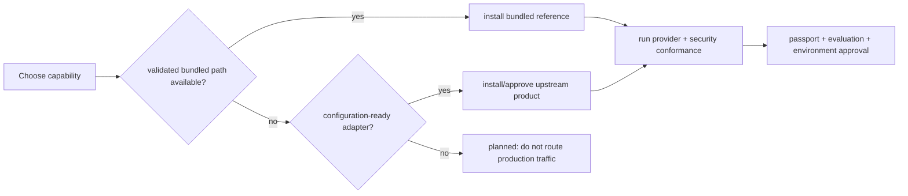

# ViewSense AI® Product and Integration Matrix

“Embedded” in ViewSense AI® has four precise meanings:

| Mode | Meaning |
|---|---|
| bundled | installed, configured, upgraded, and tested by the ViewSense AI® package |
| adapter | ViewSense AI® installs a zero-trust API adapter; the upstream product is selected separately |
| managed dependency | an upstream operator/chart is installed by the platform team and consumed through a documented profile |
| external | an existing enterprise or cloud service is connected through a stable ViewSense AI® contract |

The machine-readable source is `product-catalog.json`. `readiness=validated` means the repository's
automated suite executes that path. `configuration-ready` means Helm values, secrets, network and
conformance requirements are defined, but a real upstream installation and credentials are required
to execute it. `planned` is never presented as selectable production functionality.

## Current product choices

| Capability | Product | Mode | Readiness | What ViewSense AI® provides |
|---|---|---|---|---|
| human identity | development issuer | bundled | validated | local client credentials for tests only |
| human identity | Keycloak or generic OIDC | external | configuration-ready | edge issuer/JWKS/audience/scope/tenant validation |
| workload identity | static development PKI | bundled | validated | local mTLS certificates for tests only |
| workload identity | SPIFFE/SPIRE | managed dependency | planned | values and SDS/mesh design only; no SVID consumer ships |
| agents | built-in bounded runtime | bundled | validated | persistent runs, versions, budgets, approval, cancellation, events |
| agents | LangGraph-compatible runtime | adapter | planned | stable contract only; no adapter has shipped |
| memory | PostgreSQL + pgvector | bundled | validated | canonical memory API, isolated database, deterministic test embeddings |
| memory | Mem0 OSS or Platform | adapter | configuration-ready | credential-isolated adapter, tenant/owner pseudonymization, normalization |
| LLM | deterministic OpenAI-compatible mock | bundled | validated | contract and failure testing only |
| LLM | OpenAI API | adapter | configuration-ready | credential-isolated adapter, fixed model/endpoint, Helm and development Kustomize profile, manual live memory-grounding test |
| LLM | vLLM or external OpenAI-compatible endpoint | external | planned | requires a ViewSense AI® mTLS/JWT adapter; endpoint values alone are insufficient |
| ingestion | deterministic paragraph chunker | bundled | validated | synchronous chunking and memory writes |
| ingestion | Unstructured-compatible provider | external | planned | adapter contract has not shipped |
| tool/MCP | ViewSense AI® mock tool provider | bundled | validated | registry plus `/v1/tools/call`; not native MCP transport |
| tool/MCP | MCP Streamable HTTP provider | adapter | planned | protocol adapter/certification runtime has not shipped |
| policy | built-in admission checks | bundled | validated | capability, residency, classification, expiry, revocation, evaluation gates |
| policy | OPA sidecar | bundled | configuration-ready | chart-rendered governance sidecar; production bundle operations are environment-owned |
| workflows | n8n, Temporal, or Argo Workflows | external | planned | selection intent and design contract; adapter not yet shipped |
| observability | JSON stdout | bundled | validated | one-object-per-line vendor-neutral application logs |
| observability | OpenTelemetry Collector | managed dependency | configuration-ready | collect JSON stdout; native application OTLP export is planned |
| SIEM | Elastic or Splunk | external | configuration-ready | JSON/collector routing contract; backend is enterprise-operated |

The default portable suite is the set of validated bundled products. Optional profiles are under
`charts/viewsense/profiles/`; `enterprise-suite.yaml` is an integration blueprint, not a claim that
its upstream platforms are installed. Exact Helm paths and required tests are in
`product-catalog.json`.
